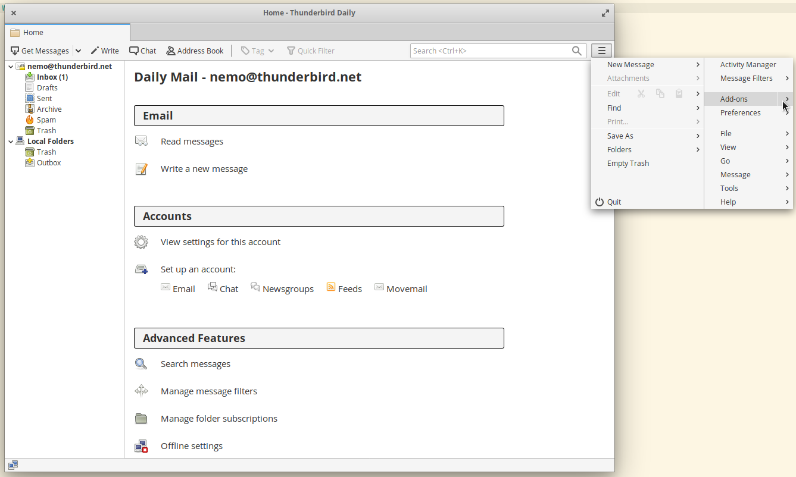
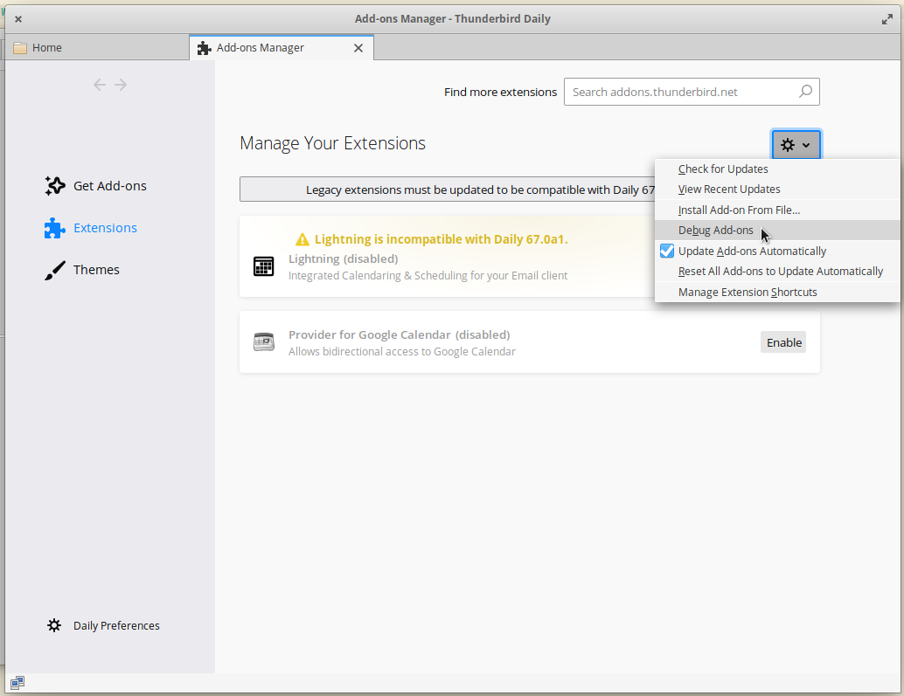
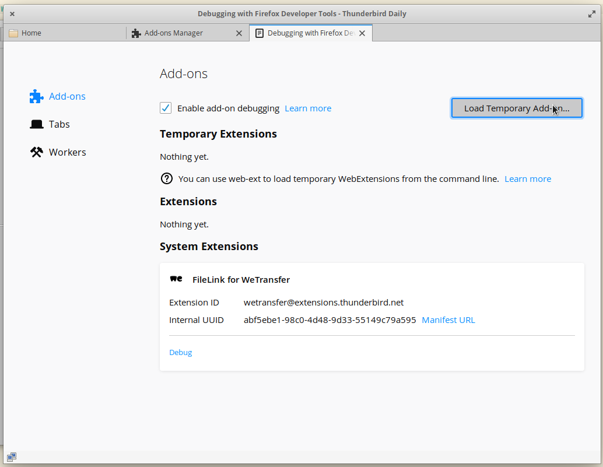
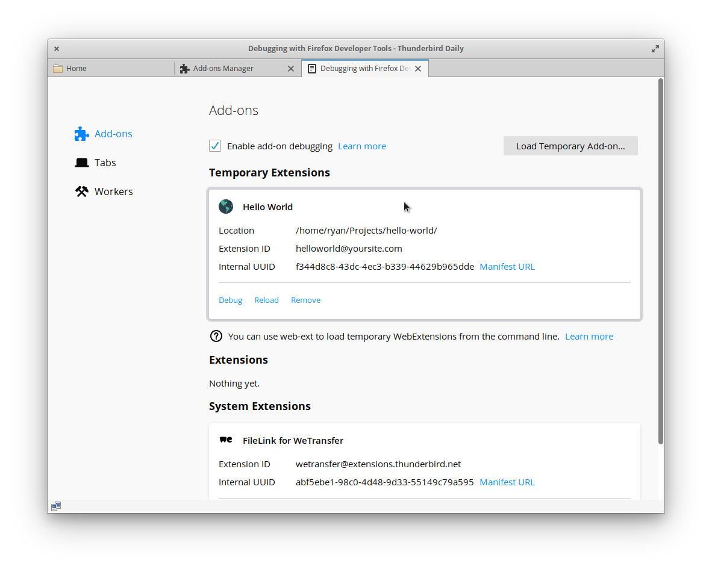
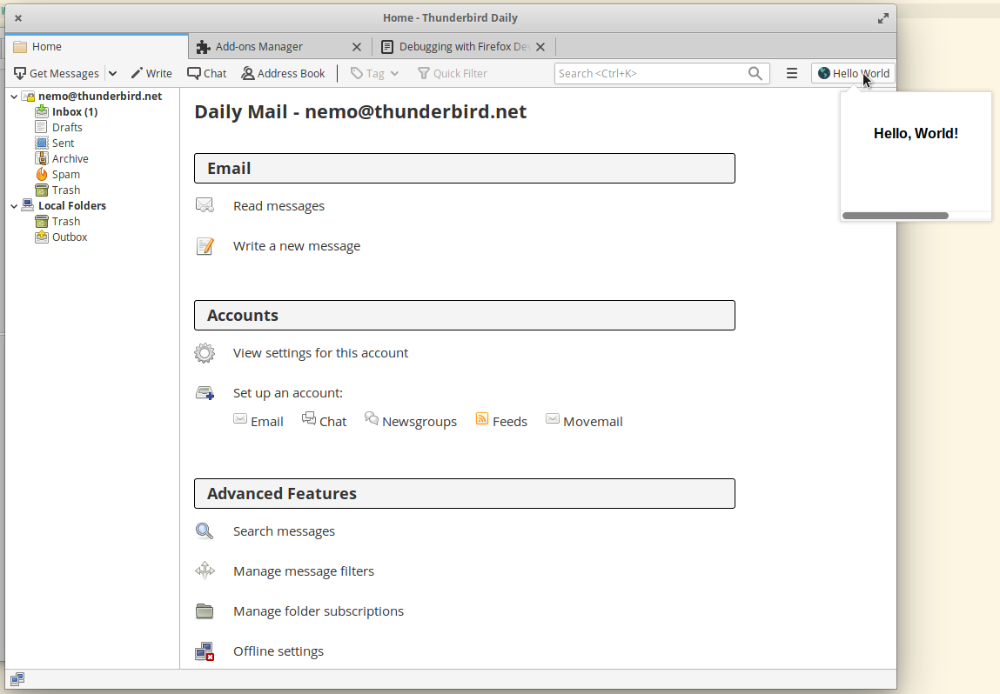

# Hello World MailExtension


This tutorial is for building a MailExtension for **Thunderbird 68** or later.


## Thunderstorm

This tutorial is based off of code that can be found, along with other tutorials and resources, in the [Thunderstorm repository](https://github.com/cleidigh/ThunderStorm) maintained by Thunderbird contributor Christopher Leidigh.

## Writing the Extension

Create a directory for your extension and navigate to it.

```text
mkdir hello-world
cd hello-world
```

### manifest.json

Extensions require a manifest.json file that tells Thunderbird basic information about the add-on.

Your manifest.json file should look like this:


```javascript
{
    "manifest_version": 2,
    "name": "Hello World",
    "description": "Your basic Hello World extension!",
    "version": "1.0",
    "author": "[Your Name Here]",
    "applications": {
        "gecko": {
            "id": "helloworld@yoursite.com",
            "strict_min_version": "66.0"
        }
    },
    "browser_action": {
        "default_popup": "popup.html",
        "default_title": "Hello World",
        "default_icon": "images/internet-32px.png"
    },
    "permissions": [
    ],
    "icons": {
        "64": "images/internet.png",
        "32": "images/internet-32px.png",
        "16": "images/internet-16px.png"
    }
}
```


#### Understanding the structure of manifest.json

At a glance there may appear to be a lot going on in this file, but it's actually pretty straightforward.

You can ignore `manifest_version` as it is mandatory and is simply meant to signal compatibility to Thunderbird.

`name` should be the name of your add-on, `description` should be a brief description of what your add-on does, `version` is a number that denotes which version of your add-on you are working on, and `author` should be your name or company.

What you need to know about the `applications` portion of the manifest.json:

* `id` serves as a unique indentifier for your add-on, it is common practice to put the add-on name @ your website. 
* `strict_min_version`should be the lowest version of Thunderbird you are targeting. Make sure to test your add-on with the version you put there to ensure it works properly.

`browser_action` specifies the toolbar button. We're supplying three pieces of information here:

* `default_icon` is mandatory, and points to the icon for the button.
* `default_title` is optional, and will be shown in a tooltip.
* `default_popup` is used if you want a popup to be shown when the user clicks the button. We do, so we've included this key and made it point to an HTML file included with the extension.

`icons` tells Thunderbird where the icons we are using for our add-on are. You can grab the icons we use for this example from the [Thunderstorm repo](https://github.com/cleidigh/ThunderStorm/tree/master/examples/HelloWorlds/HelloWorld-MailExt-Popup/images). Make sure to create an `images` directory in the `hello-world` project folder for them.


Alternatively, you could supply an SVG file here, and it will be scaled correctly.


### popup.html

Our add-on is pretty simple, it just brings up an html page in a new tab in Thunderbird. Here we are going to create the page that is pulled up. Let's create popup.html in the `hello-world` directory alongside `manifest.json`.


```markup
<!DOCTYPE html>
<html>
<head>
    <meta charset="utf-8">
    <title>Hello World</title>
    <link rel="stylesheet" type="text/css" media="screen" href="popup.css">
    <script src="scripts/popup.js"></script>
</head>
<body>
    <div class="popup-page">
    Hello, World!
    </div>
</body>
</html>
```


### popup.css

Now we want to make the css file referenced in our html file. We'll call it `popup.css`. This is just for decoration of the page, we'll put it in the same folder.


```css
.popup-page {
    font-family: 'Segoe UI', Tahoma, Geneva, Verdana, sans-serif;
    font-weight: bold;
    width: 100%;
    height: 60px;
    padding: 30px;
}
```


### popup.js

At this point if you were to install the add-on it would perform its function - but we're going to add in another layer to things before we're done. We're going to create a folder called `scripts` in the `hello-world` directory, and create a file called `popup.js` within that `scripts` folder.

In `popup.js` we will put the following code:


```javascript
// Below is what we'll log to the console.

console.log('Hello, World! - from popup.js');
```


What our little script does is sends a message to the console each time we click on our add-on. We'll take a look at that in a moment when we try out our add-on. The first line is just a comment so we can remember what our code is doing.

## Testing the Extension

First, let's double-check that we have all the files in the right places:

```text
hello-world/
    ├── manifest.json
    ├── popup.html
    ├── popup.css
    ├── scripts/
       └── popup.js
    ├── images/
       ├── internet.png
       ├── internet-32px.png
       └── internet-16px.png
```

### Installing

To install the add-on we created we are going to load it temporarily. Let's start by opening the Add-ons Manager:



This will open up the Add-ons Manager, make sure "Extensions" is selected on the left hand side and click the gear to select "Debug Add-ons".



Select "Load Temporary Add-on" and then you can choose any file from within our `hello-world` project folder.



This should install the Add-on for this session only:



### Trying it Out

Now we can give our new add-on a whirl. Hit the "Debug" option under the add-on's listing \(pictured above\), this will bring up a console - we'll want that to see the results of the javascript console.log command we put in `popup.js`.


When you click on Debug, if you are prompted with a warning telling you there is a connection to your computer from 127.0.0.1 - that is your computer and it is fine. Hit OK and the Developer Tools window with the console will appear.


Make sure the "Console" tab is selected in the Developer Tools window. Click the "Persist Logs" checkbox in the top right-hand corner of the Developer Tools so that we can see the output from the add-on after we've interacted with it \(otherwise it only shows output as it is happening\).

#### Hello, World!

Head to the home tab and click on the add-on's icon in the top right-hand corner to see a pop up with your message "Hello, World!"



Now if you look at the Developer Tools window, you should see something like the following in the console:


## What's Next

Try playing around with the popup.js script, changing the message or, if you are familiar with JavaScript - doing more interesting things. You can also change the content of the pop up window via `popup.html` and `popup.css`.

If you want to do something more complicated, check out the MailExtension APIs via its documentation: [MailExtension APIs](https://thunderbird-webextensions.readthedocs.io/)

## Creating the add-on file

Once your add-on is ready for release or if you want to share it with others, you need to create a single add-on file. Simply zip the content of your add-on directory and use the `xpi` file extension. That file can be installed from the gear menu in the Thunderbird Add-On manager.

