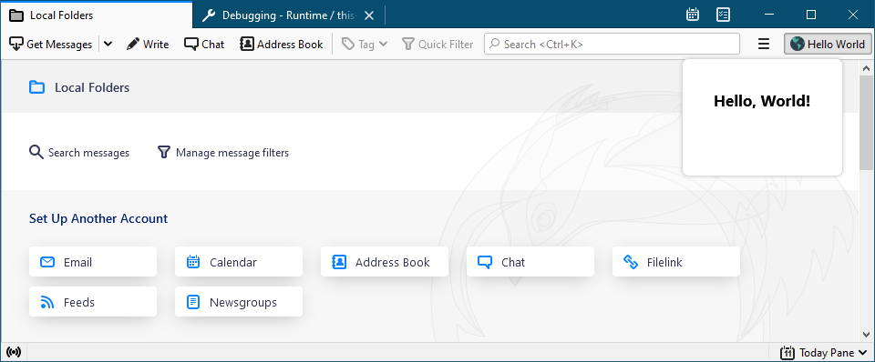
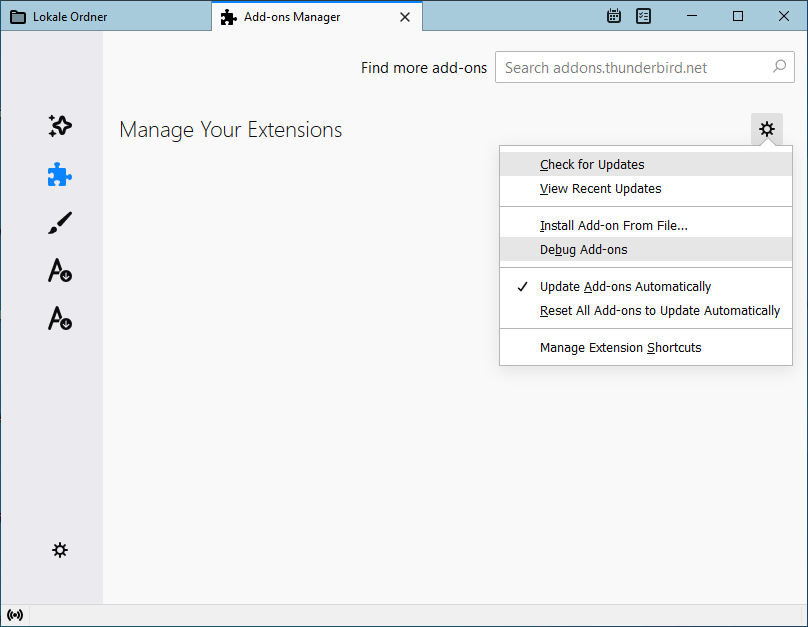
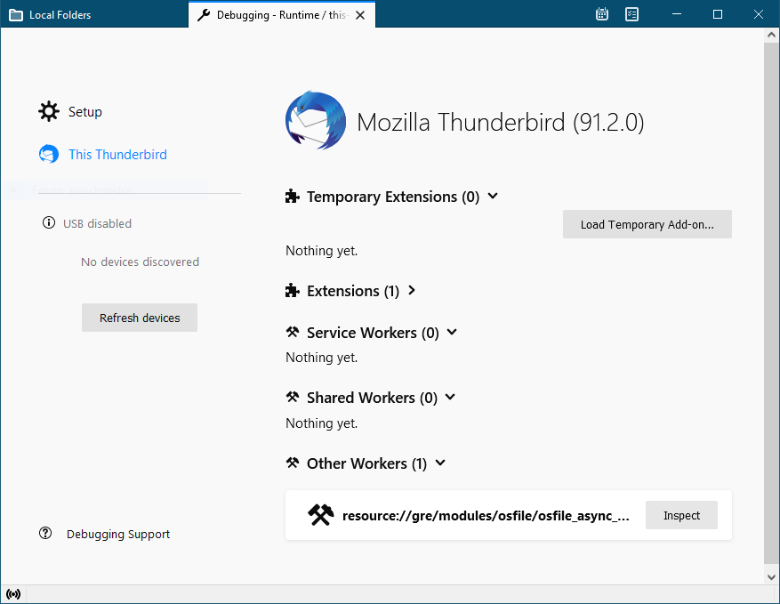
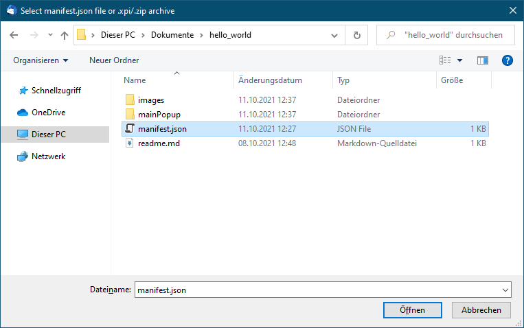
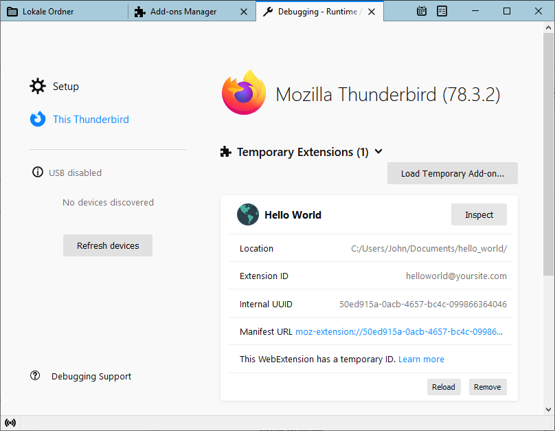
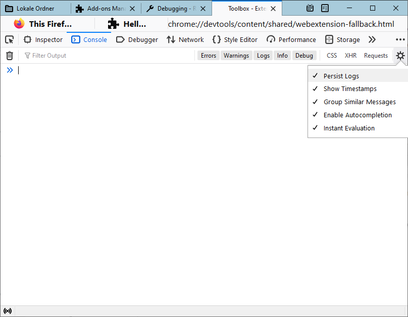
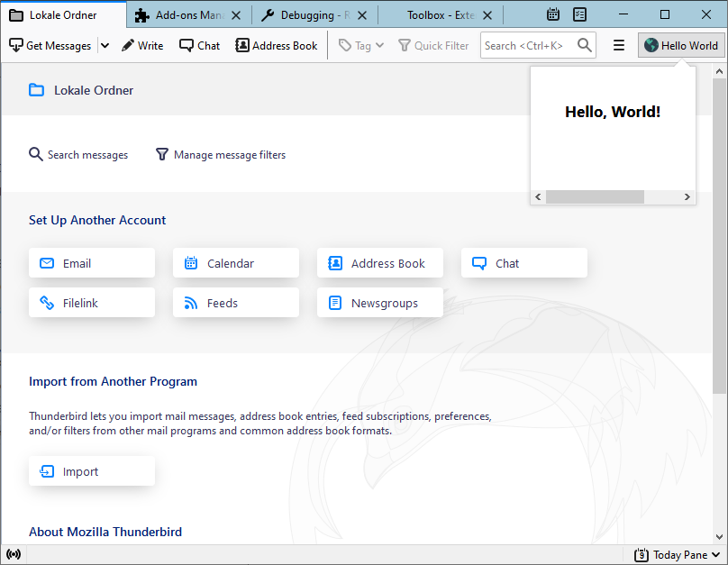
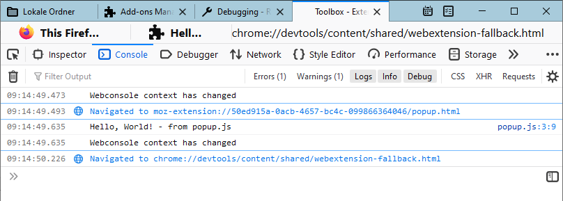

# A "Hello World" Extension Tutorial

In the first part of this tutorial, we will create a very simple extension, which adds a "_Hello World_" button to Thunderbird's main toolbar and a click on it will show a `Hello, World!` popup.



## Creating a manifest.json

First, we create an empty `hello-world` project folder for our extension and navigate to it.

Extensions require a `manifest.json` file that tells Thunderbird a few basic information about the add-on. Let's place the following `manifest.json` file directly in the `hello-world` project folder.


```json
{
    "manifest_version": 2,
    "name": "Hello World Example",
    "description": "A basic Hello World example extension!",
    "version": "1.0",
    "author": "Thunderbird Team",
    "browser_specific_settings": {
        "gecko": {
            "id": "helloworld@yoursite.com",
            "strict_min_version": "128.0"
        }
    },
    "browser_action": {
        "default_popup": "mainPopup/popup.html",
        "default_title": "Hello World",
        "default_icon": "images/internet-32px.png"
    },
    "icons": {
        "64": "images/internet.png",
        "32": "images/internet-32px.png",
        "16": "images/internet-16px.png"
    }
}
```


You can grab the icons we use for this example from the [example repository](https://github.com/thunderbird/sample-extensions/tree/master/hello-world/images). Make sure to create an `images` directory in the `hello-world` project folder for them.

## Using a `browser_action`

The above manifest includes the definition for a `browser_action`. That is the button we want to add to Thunderbird's main toolbar. The reference to a _browser_ in its name is inherited from the Firefox Browser.

The allowed keys for the `browser_action` button are described in our [API documentation](https://webextension-api.thunderbird.net/en/stable/). We define a popup HTML page, which should be loaded if the button is clicked, a title and an icon.

### popup.html

The location of the HTML file loaded by the popup of our `browser_action` is defined in the `browser_action.default_popup` key. Let's create a `mainPopup` directory in the `hello-world` project folder for everything related to that popup and start with the following `popup.html` .


```html
<!DOCTYPE html>
<html>

<head>
    <meta charset="utf-8">
    <title>Hello World</title>
    <link rel="stylesheet" type="text/css" media="screen" href="popup.css">
</head>

<body>
    <div class="popup-page">
        Hello, World!
    </div>
    <script type="module" src="popup.js"></script>
</body>

</html>
```



The default [**content security policy**](https://developer.mozilla.org/en-US/docs/Mozilla/Add-ons/WebExtensions/Content\_Security\_Policy#Inline\_JavaScript) disallows JavaScript placed directly in `<script>` tags and inline event handlers like `onclick`. Place all Javascript code into a separate file (like popup.js in this example) and use [addEventListener()](https://developer.mozilla.org/de/docs/Web/API/EventTarget/addEventListener) instead of inline event handlers.



The `script` tag to include `popup.js` is setting `type="module"`, which loads the script as a top level ES6 module. This enables the script to use the await keyword in file scope code and to load other ES6 modules.

We will not use these features in this step of the tutorial, but we still use the modern ES6 module approach here to introduce it as a standard programming practice.


### popup.js

We're going to create the following file called `popup.js` and place it in the same folder as the `popup.html` file.


```javascript
// Below is what we'll log to the console.

console.log('Hello, World! - from popup.js');
```


What our little script does is sending a message to the console each time we click on our "_Hello World_" toolbar button. We'll take a look at that in a moment when we try out our add-on. The first line is just a comment, so we can remember what our code is doing.

### popup.css

Now we want to create the CSS file referenced in our HTML file. We'll call it `popup.css`. This is just for decoration of the page, we'll put it in the same folder as the `popup.html` file.


```css
.popup-page {
    font-family: 'Segoe UI', Tahoma, Geneva, Verdana, sans-serif;
    font-weight: bold;
    height: 60px;
    padding: 10px;
}
```


## Testing the Extension

First, let's double-check that we created [the correct files](https://github.com/thunderbird/sample-extensions/commit/230eba3fd9f5c633cb30c0a83d5500e532c283c4?diff=unified) and have them in the right places:

```
hello-world/
  ├── manifest.json
  ├── images/
      ├── internet.png
      ├── internet-16px.png
      └── internet-32px.png
  └── mainPopup/
      ├── popup.css
      ├── popup.html
      └── popup.js
```

### Installing

To install the add-on we created, we are going to load it temporarily. Let's start by opening the Add-ons Manager:


This will open up the Add-ons Manager, make sure "Extensions" is selected on the left-hand side and click the gear to select "Debug Add-ons".



Click on the "Load Temporary Add-on..." button:



Select the `manifest.json` file from within our `hello-world` project folder:



This should install the add-on for this session only:



### Opening the Error Console

Our extension will print messages to the error console using `console.log()`, so we need to open the error console first, in order to see those log entries. Hit the "Inspect" button under the add-on's listing (pictured above), this will bring up the Developer Tools tab.

Make sure the "Console" tab is selected in the Developer Tools. Click the "Persist Logs" checkbox in the top right-hand corner of the Developer Tools so that we can see the output from the add-on after we've interacted with it (otherwise it only shows output as it is happening).



### Trying it Out

Now we can give our new add-on a whirl. Head to the home tab and find the new "_Hello World_" button in the main toolbar in the top right-hand corner. Click on it to see a popup with the `Hello, World!` message.



Now, if you look at the Developer Tools, you should see something like the following in the console:



## Creating the add-on file

Once the add-on is ready for release or if you want to share it with others, you need to create a single add-on file. Simply zip the content of the add-on's project folder and use the `xpi` file extension. That file can be installed from the gear menu in the Thunderbird Add-ons Manager.
