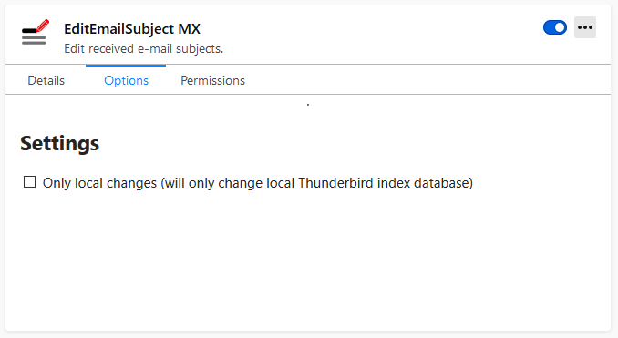

# A Guide to MailExtensions

## Introduction

MailExtensions are based on the WebExtension technology, which is also used by many web browsers. Such an extension is a simple collection of files which modify Thunderbirds appearance and behavior. It can add user interface elements, alter content, or perform background tasks. MailExtensions are created using standard JavaScript, CSS and HTML. Interaction with Thunderbird itself, like adding UI elements or accessing the users messages or contacts is done through special WebExtension APIs.


Even though Thunderbird Themes are also MailExtensions, they have a very distinct objective and are therefore described [in their own guide](../web-extension-themes.md).


.png>)

Unlike older legacy extensions, MailExtensions access functionality through stable WebExtension APIs and do not have direct access to Thunderbird's internal components or UI elements. Consequently, MailExtensions are less likely to break and do not need frequent and complex updates when Thunderbird's internals change.

The main configuration file of a MailExtension is a file called `manifest.json`, also referred to as the _manifest_. Besides defining some of the extension's basic properties like name, description and ID, it also defines how the extension hooks into Thunderbird:


```json
{
    "manifest_version": 2,
    "name": "Hello World",
    "description": "A basic Hello World extension!",
    "version": "1.0",
    "author": "[Your Name Here]",
    "applications": {
        "gecko": {
            "id": "helloworld@yoursite.com",
            "strict_min_version": "78.0",
            "strict_max_version": "78.*"
        }
    },
    "icons": {
        "64": "images/icon-64px.png",
        "32": "images/icon-32px.png",
        "16": "images/icon-16px.png"
    },
    "background": {
        "scripts": [
            "background.js"
        ]
    },
    "options_ui": {
      "page": "options/options.html",
      "open_in_tab": false,
      "browser_style": true
    },
    "permissions": [
      "storage"
    ]
}
```


## Manifest keys

A list of all manifest keys supported by Thunderbird can be found in the following document:


[supported-manifest-keys.md](supported-manifest-keys.md)


The most commonly used manifest keys are explained below.

### Basic extension properties

The following manifest keys define basic properties:

* `manifest_version`: _mandatory key_ to signal compatibility to Thunderbird, must be set to `2`
* `name` : _mandatory key_ to set the name of the extension
* `version` : _mandatory key_ to define a number that denotes the version of the extension
* `description` : a brief description of what the extension does
* `author` : should be the name of a person or company representing the extensions developer


The `name` and the `description` of the given example are only in English. [This MDN article about **Localization**](https://developer.mozilla.org/en-US/docs/Mozilla/Add-ons/WebExtensions/Internationalization#Internationalizing\_manifest.json) explains how to use the WebExtension i18n API to localize these keys.


The `applications.gecko` manifest key defines the following properties:

*   `id`: The id serves as a unique identifier for the extension and is mandatory in order upload an extension to ATN or to be able to install it from an XPI file.\


    Best practice is to use "email-address-style" ids on a domain you control, for example\
    `name-of-your-addon@example.com`, if you own `example.com`. As the id of your add-on cannot get changed once it is published, it is highly recommended to use a domain that you plan to keep for the forseeable future. If you don't have a domain that fits the bill, feel free to use `your-atn-username.addons.thunderbird.net` (based on your username on [ATN](https://addons.thunderbird.net)).\


    Alternatively to the preferred style, you may use an UUID enclosed in curly braces, for example\
    `{e4aa2097-8ee9-49a4-9ec7-c633b1e8dfda}`. Make sure you generate a new UUID for each add-on you want to develop, you can find free UUID generators throughout the internet.
* `strict_min_version`: Defines the lowest targeted version of Thunderbird.
* `strict_max_version`: Defines the highest targeted version of Thunderbird. It can be set to a specific version or a broader match to limit it to a branch (for example `78.*`).

```json
    "applications": {
        "gecko": {
            "id": "helloworld@yoursite.com",
            "strict_min_version": "78.0",
            "strict_max_version": "78.*"
        }
    }
```

### Extension Icons

The `icons` manifest key tells Thunderbird the location of icons, which should be used to represent the MailExtension. Thunderbird supports basic image types like PNG files, but also SVG files. Thunderbird uses different file icon sizes in different places and allows registering a dedicated file for each size. The MailExtension will use the standard puzzle icon, if no icons have been defined.

```json
    "icons": {
        "64": "images/icon-64px.png",
        "32": "images/icon-32px.png",
        "16": "images/icon-16px.png"
    }
```

### Background Page

Each MailExtension has a hidden background page. Its main purpose is to load and execute JavaScript files when the MailExtension is loaded. There are two options for its definition:

#### Defining one or more background scripts

```json
    "background": {
        "scripts": [
            "common.js",
            "background.js"
        ]
    }
```

This will create the background page on-the-fly and load the provided scripts. This is identical to the following background page definition.

#### Defining a background page

```json
    "background": {
        "page": "background.html"
    }
```

The defined background page can then load the JavaScript files:

```markup
<html lang="en">
    <head>
        <meta charset="utf-8">
        <script src="common.js"></script>
        <script src="background.js"></script>
    </head>
    <body>
    </body>
</html>
```

### Options Page

The `options_ui` manifest key defines the standard MailExtension options page. The defined page will be displayed in the add-on manager.

```json
    "options_ui": {
      "page": "options/options.html",
      "open_in_tab": false,
      "browser_style": true
    }
```

The appearance of the options page can be configured as follows:

* `open_in_tab` : Open the options page in a tab instead of inline in the add-ons property page.
* `browser_style`: Use default browser styles for the options page (recommended).

An inline options page may look as follows:



### User Interface Elements

Some UI elements MailExtensions can use are controlled by manifest keys, for example

* browser\_action
* compose\_action
* message\_display\_action

Further information about these UI elements can be found in the following document:


[supported-ui-elements.md](supported-ui-elements.md)


### Permissions

A core principle of the WebExtension technology is the use of permissions, so users can see which areas of Thunderbird a MailExtension wants to access. Add-on developers can predefine all requested permissions in the `permissions` manifest key:

```json
    "permissions": [
      "storage"
    ]
```

As permissions allow WebExtensions to use certain APIs, information about supported permissions can be found in the following document:


[supported-webextension-api.md](supported-webextension-api.md)


## WebExtension Scripts

Most entry points defined in the extensions manifest allow adding scripts. Most prominent of course the background script(s). Furthermore, each defined HTML page, like the `options_ui` page allow including scripts via standard HTML `<script>` tags.


In order to use modern [ES6 modules](https://hacks.mozilla.org/2015/08/es6-in-depth-modules/) in a loaded script, the `type` attribute of its `script` tag must be set to `module`.

```markup
<script type="module" src="background.js"></script>
```


All these WebExtension scripts have access to:

* Standard JavaScript methods
* [Web API](https://developer.mozilla.org/docs/Web/API) (if the browser compatibility chart lists Firefox, the API also works in Thunderbird)
* WebExtension API

A list of all WebExtension APIs supported by Thunderbird can be found in the following document:


[supported-webextension-api.md](supported-webextension-api.md)


### Content Scripts

Content scripts (including [compose scripts](https://webextension-api.thunderbird.net/en/latest/composeScripts.html) and [message display scripts](https://webextension-api.thunderbird.net/en/latest/messageDisplayScripts.html)) can only access [a small subset of the WebExtension APIs](https://developer.mozilla.org/en-US/Add-ons/WebExtensions/Content\_scripts#WebExtension\_APIs), but they can [communicate with background scripts](https://developer.mozilla.org/en-US/Add-ons/WebExtensions/Content\_scripts#Communicating\_with\_background\_scripts) using a messaging system, and thereby indirectly access the WebExtension APIs.

### Option Scripts

Access to WebExtension APIs in options pages using `options_ui.open_in_tab: false` is currently broken. Use `getBackgroundPage()` to replace the `browser` object of the options page with the `browser` object of your background page.

```javascript
const browser = window.browser.extension.getBackgroundPage().browser;
```

### CloudFile Management Scripts

A script loaded from a CloudFile[ `management_url`](https://webextension-api.thunderbird.net/en/latest/cloudFile.html#manifest-file-properties) has access to a limited subset of the WebExtension APIs:

* cloudFile
* extension
* i18n
* runtime
* storage

## Creating MailExtensions: Examples

Our [sample-extensions repository](https://github.com/thundernest/sample-extensions) includes a few simple MailExtensions, which showcase different APIs and which will get you started to create your own extension.

We also prepared a step-by-step guide for a small Hello World MailExtension:


[hello-world-add-on](hello-world-add-on/)


## Experiment APIs

The currently available WebExtension APIs are not yet sufficient, as some areas of Thunderbird are not accessible through these APIs. We are working on improving the situation.

Currently and for the foreseeable future Thunderbird supports Experiment APIs (a.k.a. Experiments), which are WebExtension APIs that are bundled and shipped together with a MailExtension. They interact directly with Thunderbird's internal APIs and allow add-ons to use additional features not yet available via built-in WebExtension APIs.

These additional APIs can be registered in the `manifest.json` file by defining an implementation script and a schema file describing the interface:

```json
    "experiment_apis": {
        "LegacyPrefs": {
            "schema": "api/LegacyPrefs/schema.json",
            "parent": {
                "scopes": ["addon_parent"],
                "paths": [["LegacyPrefs"]],
                "script": "api/LegacyPrefs/implementation.js",
                "events": ["startup"]
            }
        }
    }
```


Experiment APIs have full access to Thunderbird's core functions and can bypass the WebExtension permission system entirely. Including one or more Experiment APIs will therefore disable the individual permission prompt and instead prompt the user only for the [_Have full, unrestricted access to Thunderbird, and your computer_](https://support.mozilla.org/kb/permission-request-messages-thunderbird-extensions) permission.


If you'd like to learn more about experiments, check out this detailed introduction:


[experiments.md](experiments.md)


### Sharing Experiment APIs

Developers can share and re-use Experiments, if their add-ons have similar needs. Before starting to work on your own Experiment, check if any of the following APIs could already provide the functionality you need. Using them and providing feedback to their developers will help to improve these APIs.

| Name                                                                                                           |                                                                                                                                                                                                                                                         | Description                                                                                                                                                                                                                       |
| -------------------------------------------------------------------------------------------------------------- | :-----------------------------------------------------------------------------------------------------------------------------------------------------------------------------------------------------------------------------------------------------: | --------------------------------------------------------------------------------------------------------------------------------------------------------------------------------------------------------------------------------- |
| [CachingFix](https://github.com/rsjtdrjgfuzkfg/thunderbird-experiments/tree/master/experiments/cachingfix)     |                                                                                                                                                                                                                                                         | Adding this Experiment API will automatically [fix caching issues when the add-on is updated, disabled or uninstalled](https://developer.thunderbird.net/add-ons/mailextensions/experiments#managing-your-experiments-lifecycle). |
| [Calendar](https://github.com/thundernest/tb-web-ext-experiments/blob/master/calendar)                         | [💬](https://thunderbird.topicbox.com/groups/addons/Ta66e29a70cfa405f-M7357f9e59c7228cc1632b601/draft-for-mailextensions-related-to-calendaring) [📝](https://docs.google.com/document/d/15awbKiVfdOTmsRpgD1dxm3gvOt08EQZDSnMl8QRBFoY/edit?usp=sharing) | Draft for calendar-related APIs in Thunderbird.                                                                                                                                                                                   |
| [ComposeMessageHeaders](https://github.com/gruemme/tb-api-compose\_message\_headers)                           |                                                                                                                                                                                                                                                         | Adds missing functionality to add headers to a newly composed message. Aims to add a header object to the compose.ComposeDetails object, so headers can be set via compose.setComposeDetails.                                     |
| [CustomUI](https://github.com/rsjtdrjgfuzkfg/thunderbird-experiments/tree/master/experiments/customui)         |                                                                             [💬](https://thunderbird.topicbox.com/groups/addons/T07afba099782a5c5/customui-api-experiment)​                                                                             | A generic UI extension framework based on iframes registered at fixed extension points.                                                                                                                                           |
| [FileSystem](https://github.com/thundernest/addon-developer-support/tree/master/auxiliary-apis/FileSystem)     |                                                                                                                                                                                                                                                         | An API to access files in the users profile folder. Until Mozilla has made a final decision about including the [Chrome FileSystem API](https://web.dev/file-system-access/), this API can be used as an interim solution.        |
| [LegacyMenu](https://github.com/thundernest/addon-developer-support/tree/master/auxiliary-apis/LegacyMenu)     |                                                                                                                                                                                                                                                         | Add menu entries to Thunderbird menus currently not accessible using the built-in menus API.                                                                                                                                      |
| [LegacyPrefs](https://github.com/thundernest/addon-developer-support/tree/master/auxiliary-apis/LegacyPrefs)   |                                                                                                                                                                                                                                                         | Access Thunderbird system preferences.                                                                                                                                                                                            |
| [NotificationBar](https://github.com/jobisoft/notificationbar-API/tree/master/notificationbar)                 |                    [💬](https://thunderbird.topicbox.com/groups/addons/T576f843ea846049c-M2b3bf1c77ba25dfb1d78e7d4/notification-api-proposal) [📝](https://docs.google.com/document/d/1mTwVozOiEcDCw3QQKxVz-N5yHY8SVFC9KUL4\_x0IN68/)                   | Add Thunderbird notification bars.                                                                                                                                                                                                |
| [onAfterSend](https://github.com/int-red/experiment-api-composeevent)                                          |                                                                                                                                                                                                                                                         | Adds "onAfterSend" event. It returns the messageId of the sent email in the Sent folder.                                                                                                                                          |
| [Runtime.onDisable](https://github.com/rsjtdrjgfuzkfg/thunderbird-experiments/tree/master/experiments/runtime) |                                                                                                                                                                                                                                                         | Permit WebExtensions to perform (time-limited) cleanup tasks after the add-on is disabled or uninstalled.                                                                                                                         |
| [TagService](https://github.com/int-red/experiment-api-tagservice)                                             |                                               [B](https://bugzilla.mozilla.org/show\_bug.cgi?id=1651954) [💬](https://thunderbird.topicbox.com/groups/addons/T748f8fbd94681aa6-Me57c565c9f0111b493771c77)                                               | Add/Manage email tags.                                                                                                                                                                                                            |
| [TCP](https://github.com/rsjtdrjgfuzkfg/thunderbird-experiments/tree/master/experiments/tcp)                   |                                                                                                                                                                                                                                                         | TCP support based on ArrayBuffers (currently client side only).                                                                                                                                                                   |

💬: API has a public announcement post\
📝: API has a public interface discussion\
B : Bugzilla Bug

If you have created an Experiment API which you think could be beneficial to other developers, please [tell us about it](https://github.com/thundernest/developer-docs/issues/new), so we can include it here.

### Proposing APIs to be included in Thunderbird

Creating a good WebExtension API for Thunderbird is not an easy task. New APIs need to be generic and distinct from other APIs. Their interfaces have to be designed with foresight as we should avoid scenarios, where we have to make backward incompatible changes later because we have missed something.

If you want to propose and maybe collaborate on a new API, the following process is suggested:

1. Announcing the idea and a first outline of the suggested API on [discuss.thunderbird.net](https://discuss.thunderbird.net/groups/addons). An actual implementation is not yet needed, but a general concept of how the API is supposed to work is helpful. This allows the add-on developer community to provide feedback and to make sure the design will cover their needs as well.
2. Publishing a detailed API description, which can be viewed and commented. Google docs have worked quite well (see [here](https://docs.google.com/document/d/15awbKiVfdOTmsRpgD1dxm3gvOt08EQZDSnMl8QRBFoY/edit?usp=sharing) and [here](https://docs.google.com/document/d/1mTwVozOiEcDCw3QQKxVz-N5yHY8SVFC9KUL4\_x0IN68/edit)), but any platform that allows to collaborate will be sufficient. The goal is to shape out the event, function and type definitions of the API.
3. Creating a [tracking bug on bugzilla](https://bugzilla.mozilla.org/enter\_bug.cgi?product=Thunderbird\&component=Add-Ons%3A+Extensions+API), referencing the API description, so the core development team is notified and can comment as well.
4. Publishing a working implementation, so add-on developers can use it and provide feedback.
5. Adding a patch to the tracking bug and request review.
