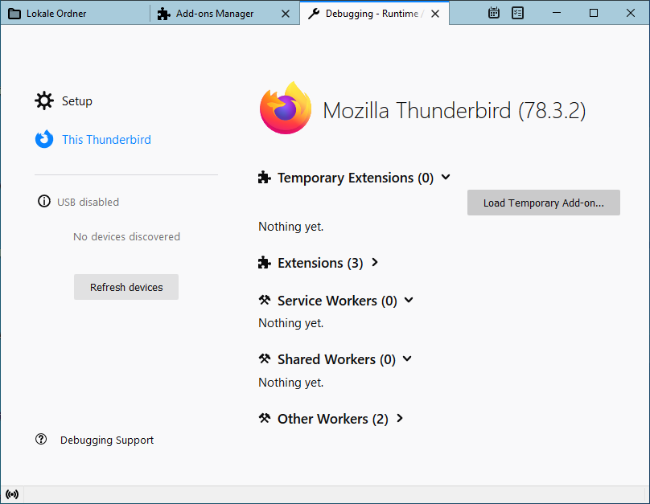
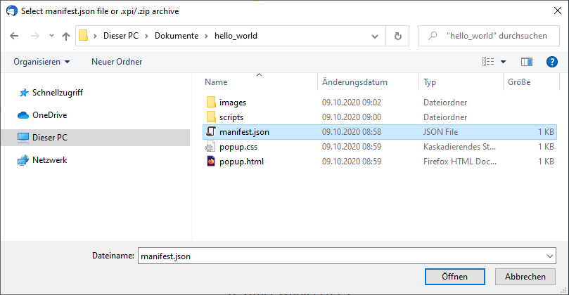

# Hello World Example

In this section, we will create a very simple extension, which adds a button to the Thunderbird UI. After the basics have been covered, we will extend the example in the following sections, to interact with the users messages and address books entries.

## Writing the Extension

Create a project folder for your extension and navigate to it.

```
mkdir hello-world
cd hello-world
```

### manifest.json

As described in our [MailExtension guide](https://developer.thunderbird.net/add-ons/mailextensions), extensions require a `manifest.json` file that tells Thunderbird basic information about the add-on. Place the `manifest.json` file directly in the `hello-world` project folder. For this example add-on it should look like this:


```javascript
{
    "manifest_version": 2,
    "name": "Hello World",
    "description": "Your basic Hello World extension!",
    "version": "1.0",
    "author": "[Your Name Here]",
    "applications": {
        "gecko": {
            "id": "helloworld@yoursite.com",
            "strict_min_version": "78.0"
        }
    },
    "browser_action": {
        "default_popup": "mainPopup/mainPopup.html",
        "default_title": "Hello World",
        "default_icon": "images/internet-32px.png"
    },
    "background": {
        "scripts": ["background.js"]
    },
    "icons": {
        "64": "images/internet.png",
        "32": "images/internet-32px.png",
        "16": "images/internet-16px.png"
    }
}
```


You can grab the icons we use for this example from the [Thunderstorm repo](https://github.com/cleidigh/ThunderStorm/tree/master/examples/MailExtensions/HelloWorld-Popup/images). Make sure to create an `images` directory in the `hello-world` project folder for them.

### mainPopup.html

Our add-on is using a `browser_action` manifest key to add a [browser action button](../supported-ui-elements.md#browser-action) to the Thunderbird UI. A click on that button will bring up a popup loading the HTML page defined in the `browser_action.default_popup` key. Let's create a `mainPopup` folder in the `hello-world` project folder for everything related to that popup and also create the following `popup.html` .


```markup
<!DOCTYPE html>
<html>
<head>
    <meta charset="utf-8">
    <title>Hello World</title>
    <link rel="stylesheet" type="text/css" media="screen" href="mainPopup.css">
    <script src="mainPopup.js"></script>
</head>
<body>
    <div class="popup-page">
    Hello, World!
    </div>
</body>
</html>
```



The default [**content security policy**](https://developer.mozilla.org/en-US/docs/Mozilla/Add-ons/WebExtensions/Content_Security_Policy#Inline_JavaScript) disallows JavaScript placed directly in `<script>` tags and inline event handlers like `onclick`. Place all your Javascript code into a separate file (like popup.js in this example) and use [addEventListener()](https://developer.mozilla.org/de/docs/Web/API/EventTarget/addEventListener) instead of inline event handlers.


### popup.css

Now we want to create the CSS file referenced in our HTML file. We'll call it `popup.css`. This is just for decoration of the page, we'll put it in the same folder.


```css
.popup-page {
    font-family: 'Segoe UI', Tahoma, Geneva, Verdana, sans-serif;
    font-weight: bold;
    height: 60px;
    padding: 10px;
}
```


### popup.js

We're going to create a directory called `scripts` inside the `hello-world` project folder, and create a file called `popup.js` within that `scripts` folder.

In `popup.js` we will put the following code:


```javascript
// Below is what we'll log to the console.

console.log('Hello, World! - from popup.js');
```


What our little script does is sending a message to the console each time we click on our add-on. We'll take a look at that in a moment when we try out our add-on. The first line is just a comment, so we can remember what our code is doing.

## Testing the Extension

First, let's double-check that we have all the files in the right places:

```
hello-world/
    ├── manifest.json
    ├── popup.html
    ├── popup.css
    ├── scripts/
       └── popup.js
    ├── images/
       ├── internet.png
       ├── internet-32px.png
       └── internet-16px.png
```

### Installing

To install the add-on we created, we are going to load it temporarily. Let's start by opening the Add-ons Manager:


This will open up the Add-ons Manager, make sure "Extensions" is selected on the left-hand side and click the gear to select "Debug Add-ons".


Click on the "Load Temporary Add-on..." button:



Select the `manifest.json` file from within our `hello-world` project folder:



This should install the Add-on for this session only:


### Opening the Error Console

Our extension will print messages to the error console using `console.log()`, so we need to open the error console first, in order to see those log entries. Hit the "Inspect" button under the add-on's listing (pictured above), this will bring up the Developer Tools tab.

Make sure the "Console" tab is selected in the Developer Tools. Click the "Persist Logs" checkbox in the top right-hand corner of the Developer Tools so that we can see the output from the add-on after we've interacted with it (otherwise it only shows output as it is happening).


### Trying it Out

Now we can give our new add-on a whirl. Head to the home tab and find the new "Hello World" button in the main toolbar in the top right-hand corner. Click on it to see a popup with your message "Hello, World!"


Now if you look at the Developer Tools, you should see something like the following in the console:

.png>)

## What's Next

Try playing around with the popup.js script, changing the message or, if you are familiar with JavaScript - doing more interesting things. You can also change the content of the popup window via `popup.html` and `popup.css`.

If you want to do something more complicated, check out the MailExtension APIs via its documentation: [MailExtension APIs](https://webextension-api.thunderbird.net)

## Creating the add-on file

Once your add-on is ready for release or if you want to share it with others, you need to create a single add-on file. Simply zip the content of your add-on directory and use the `xpi` file extension. That file can be installed from the gear menu in the Thunderbird Add-On manager.
