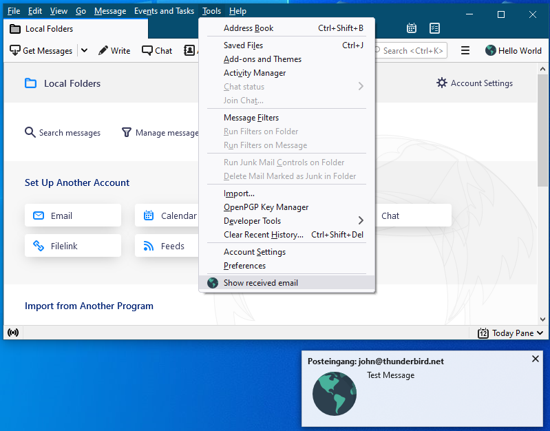
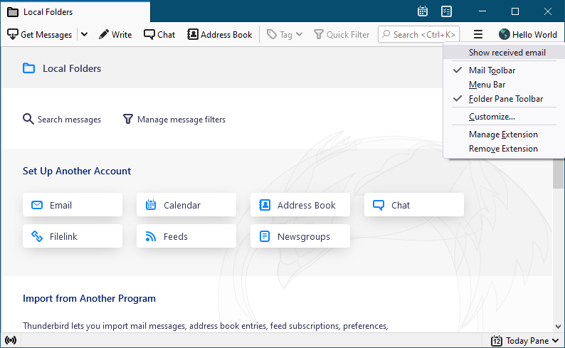

# Using a Background Page

In the third part of the Hello World Extension Tutorial, we will introduce the concept of the WebExtension background page.

We will keep track of incoming mails, add a menu entry to the tools menu and also a context menu entry to our toolbar button in Thunderbird's main toolbar and a click on both will open notifications with the collected information from the last 24h.



## Background Page and Background Scripts

In the first two parts of the Hello World Extension Tutorial, we used well-defined UI hooks to load HTML pages when the user opened one of our popups. In contrast, the background page - if defined - is automatically loaded when the add-on is enabled during Thunderbird start or after the add-on has been manually enabled or installed. It is automatically destroyed when the add-on is shutting down.

The background page is a standard HTML page, supporting the same technologies as ordinary HTML pages, but it is never shown to the user. Its main purpose is to load one or more JavaScript files into the background. Those background scripts can be used to listen for events or to initialize and properly set up the add-on. As [described in the MailExtension guide](../#background-page), there are two ways to load background scripts:

1. Actually defining a background HTML page, that uses `script` tags to load the JavaScript files.
2. Just defining the to-be-loaded JavaScript files and let Thunderbird create a background page on-the-fly.

The author of this example prefers the first option, as it allows declaring the loaded JavaScript file (in the `script` tag) as `type="module"`, which enables support for [using ES6 modules](https://developer.mozilla.org/en-US/docs/Web/JavaScript/Guide/Modules). We therefore add the following section to our `manifest.json` file:

```json
"background": {
    "page": "background.html"
},
```

We place the following `background.html` file into our `hello-world` project folder:


```html
<!DOCTYPE html>
<html>
<head>
    <script src="background.js" type="module"></script>
</head>
</html>
```


Let's create the following barebone `background.js` script in the `hello-world` project folder:


```javascript
async function load() {

}

document.addEventListener("DOMContentLoaded", load);
```


We use an event listener at the end of this script, which runs the `load` function once the background page is fully loaded. Avoid placing function calls outside of the `load` function.

### Listening for New Messages

In order to listen for new messages, we have to add a listener for the [`onNewMessageReceived`](https://webextension-api.thunderbird.net/en/91/messages.html#onnewmailreceived) event:

```javascript
messenger.messages.onNewMailReceived.addListener(async (folder, messages) => {
    // Do something with folder and messages.
})
```

The above code is using an inline arrow function to define the callback function, which is called for each `onNewMailReceived` event. This is identical to the following implicit function definition:

```java
async function onNewMailReceivedCallback(folder, messages) {
    // Do something with folder and messages.
}
messenger.messages.onNewMailReceived.addListener(onNewMailReceivedCallback)
```

The author of this example prefers to use inline arrow functions, if the function is not used elsewhere.


The `onNewMessageReceived` event requires the <mark style="color:red;">`accountsRead`</mark> permission, which needs to be added to the `permissions` key in our `manifest.json` file.


The callback function of the `onNewMailReceived` event receives two parameters: `folder` being a [`MailFolder`](https://webextension-api.thunderbird.net/en/91/folders.html#folders-mailfolder) and `messages` being a [`MessageList`](https://webextension-api.thunderbird.net/en/91/messages.html#messages-messagelist). The updated background script, which stores the folder and the message information of the new received mail, could look as follows:

```javascript
// A wrapper function returning an async iterator for a MessageList. Derived from
// https://webextension-api.thunderbird.net/en/91/how-to/messageLists.html
async function* iterateMessagePages(page) {
    for (let message of page.messages) {
        yield message;
    }

    while (page.id) {
        page = await messenger.messages.continueList(page.id);
        for (let message of page.messages) {
            yield message;
        }
    }
}

async function load() {

    // Add a listener for the onNewMailReceived events.
    await messenger.messages.onNewMailReceived.addListener(async (folder, messages) => {
        let { messageLog } = await messenger.storage.local.get({ messageLog: [] });

        for await (let message of iterateMessagePages(messages)) {
            messageLog.push({
                folder: folder.name,
                time: Date.now(),
                message: message
            })
        }

        await messenger.storage.local.set({ messageLog });
    })

}

document.addEventListener("DOMContentLoaded", load);
```

#### messenger.storage.local.get()

In line 20 of the shown script, we request the current `messageLog` entry from the WebExtensions local storage. The used syntax allows defining the default value of `[]`(an empty Array), if there currently is no `messageLog` entry stored. 

We could also request multiple values from the local storage:

```javascript
let rv = await messenger.storage.local.get({
  messageLog: [],
  aBoolValue: true,
  aStringValue: "none"
});
console.log(rv);
```

The call to `storage.local.get()` returns a Promise for a single object with the requested entries, for example the above `console.log(rv)` could produce the following output:

```json
{
  messageLog: [],
  aBoolValue: false,
  aStringValue: "The sky is the limit."
}
```

To access the content of the `messageLog` member, one would have to use `rv.messageLog`. That is sometimes not the desired behavior, and instead one could store the requested value directly in a variable, as shown in line 20 of our background script. This is called _object destructering_ and it maps the content of the `messageLog` member of the returned object to the `messageLog` variable. Any other non-matching returned member is ignored.


Access to the local storage requires the <mark style="color:red;">`storage`</mark> permission, which needs to be added to the `permissions` key in our `manifest.json` file.


#### iterateMessagePages()

Since Thunderbird's WebExtension API potentially has to handle a lot of messages, the [`MessageList`](https://webextension-api.thunderbird.net/en/91/messages.html#messagelist) data type is paginated. Please check the [Working with Message Lists](https://webextension-api.thunderbird.net/en/91/how-to/messageLists.html) tutorial for more information.

The provided` iterateMessagePages()` wrapper function is doing most of the heavy lifting and allows to asynchronously loop over the returned messages in line 22 of the shown background script. For each received message, we subsequently push a new entry into the `messageLog` Array.

#### messenger.storage.local.set()

In line 30 we store the updated `messageLog` Array back into the local storage. We use the object shorthand notation, which allows leaving out the actual value definition, if the value is stored in a variable with the same name as the object's member name. If the shorthand notation is unwanted, one could instead write the following:

```javascript
await messenger.storage.local.set({ messageLog: messageLog });
```

### Adding Menu Entries and their Actions

Let's add the following code to your `load` function, which will add both menu entries and will react to them being clicked:

```javascript
// Create the menu entries.
let menu_id = await messenger.menus.create({
    title: "Show received email",
    contexts: [
        "browser_action",
        "tools_menu"
    ],
});

// Register a listener for the menus.onClicked event.
await messenger.menus.onClicked.addListener(async (info, tab) => {
    if (info.menuItemId == menu_id) {
        // Our menu entry was clicked
        let { messageLog } = await messenger.storage.local.get({ messageLog: [] });

        let now = Date.now();
        let last24h = messageLog.filter(e => (now - e.time) < 24 * 60 * 1000);

        for (let entry of last24h) {
            messenger.notifications.create({
                "type": "basic",
                "iconUrl": "images/internet.png",
                "title": `${entry.folder}: ${entry.message.author}`,
                "message": entry.message.subject
                });                
        }
    }
});
```

#### messenger.menus.create()

In line 2 we create a new menu entry. We use the title `Show received email` and we add it to the `browser_action` context and to the `tools_menu` context. A list of other available contexts can be found on the [Supported UI Elements](../supported-ui-elements.md#menu-items) page.

The [menus.create()](https://webextension-api.thunderbird.net/en/91/menus.html#create-createproperties-callback) function returns the `id` of the new menu, which we can use to identify our menu, or - for example - add submenus by using the `id` as the `parentId` for other menu entries.


Using the `menus` API requires the <mark style="color:red;">`menus`</mark> permission, which needs to be added to the `permissions` key in our `manifest.json` file.


#### messenger.menus.onClicked()

In order to do something when our menu is clicked, we add a listener for the [onClicked](https://webextension-api.thunderbird.net/en/91/menus.html#onclicked) event. We check the `id` of the clicked menu to see which of our menus was clicked (we only added one, but checking here anyhow).

#### messenger.notifications.create()

After we have retrieved the current `messageLog` from the local storage, we loop over all entries and [create a notification](https://developer.mozilla.org/en-US/docs/Mozilla/Add-ons/WebExtensions/API/notifications) for each entry in line 20. 


Using the `notifications` API requires the <mark style="color:red;">`notifications`</mark> permission, which needs to be added to the `permissions` key in our manifest.json file.


## Testing the Extension

Let's double-check that we have all the files in the right places:

```
hello-world/
  ├── manifest.json
  ├── background.html
  ├── background.js
  ├── mainPopup/
      ├── popup.html
      ├── popup.css
      └── popup.js
  ├── messagePopup/
      ├── popup.html
      ├── popup.css
      └── popup.js
  └── images/
      ├── internet.png
      ├── internet-32px.png
      └── internet-16px.png
```

This is how our `manifest.json` should now look like:


```json
{
    "manifest_version": 2,
    "name": "Hello World",
    "description": "Your basic Hello World extension!",
    "version": "3.0",
    "author": "[Your Name Here]",
    "applications": {
        "gecko": {
            "id": "helloworld@yoursite.com",
            "strict_min_version": "78.0"
        }
    },
    "browser_action": {
        "default_popup": "mainPopup/popup.html",
        "default_title": "Hello World",
        "default_icon": "images/internet-32px.png"
    },
    "message_display_action": {
        "default_popup": "messagePopup/popup.html",
        "default_title": "Details",
        "default_icon": "images/internet-32px.png"
    },
    "permissions": [
        "messagesRead",
        "accountsRead",
        "storage",
        "menus",
        "notifications"
    ],
    "background": {
        "page": "background.html"
    },
    "icons": {
        "64": "images/internet.png",
        "32": "images/internet-32px.png",
        "16": "images/internet-16px.png"
    }
}
```


Our background script should look as follows:


```javascript
// A wrapper function returning an async iterator for a MessageList. Derived from
// https://webextension-api.thunderbird.net/en/91/how-to/messageLists.html
async function* iterateMessagePages(page) {
    for (let message of page.messages) {
        yield message;
    }

    while (page.id) {
        page = await messenger.messages.continueList(page.id);
        for (let message of page.messages) {
            yield message;
        }
    }
}

async function load() {

    // Add a listener for the onNewMailReceived events.
    await messenger.messages.onNewMailReceived.addListener(async (folder, messages) => {
        let { messageLog } = await messenger.storage.local.get({ messageLog: [] });

        for await (let message of iterateMessagePages(messages)) {
            messageLog.push({
                folder: folder.name,
                time: Date.now(),
                message: message
            })
        }

        await messenger.storage.local.set({ messageLog });
    })

    // Create the menu entries.
    let menu_id = await messenger.menus.create({
        title: "Show received email",
        contexts: [
            "browser_action",
            "tools_menu"
        ],
    });
    
    // Register a listener for the menus.onClicked event.
    await messenger.menus.onClicked.addListener(async (info, tab) => {
        if (info.menuItemId == menu_id) {
            // Our menu entry was clicked
            let { messageLog } = await messenger.storage.local.get({ messageLog: [] });

            let now = Date.now();
            let last24h = messageLog.filter(e => (now - e.time) < 24 * 60 * 1000);

            for (let entry of last24h) {
                messenger.notifications.create({
                    "type": "basic",
                    "iconUrl": "images/internet.png",
                    "title": `${entry.folder}: ${entry.message.author}`,
                    "message": entry.message.subject
                  });                
            }
        }
    });
}

document.addEventListener("DOMContentLoaded", load);
```


### Installing

As described in the [first part of the Hello World Extension Tutorial](./#installing), go to the Add-ons Manager to open the Debug Add-on Page and temporarily install the extension.

### Trying it Out

After you have received one or more new messages, while the add-on has been active, open the context menu of our `browser_action` button in Thunderbird's main toolbar and click on "Show received emails". For each received message, you should see a notification.


