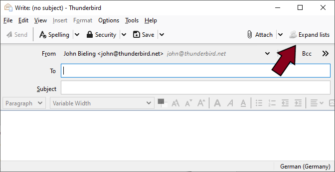
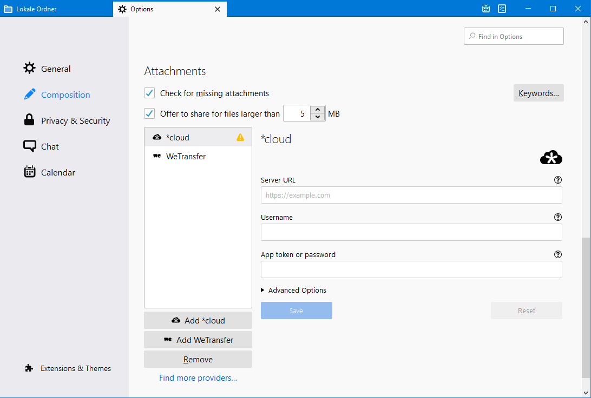
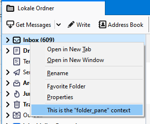
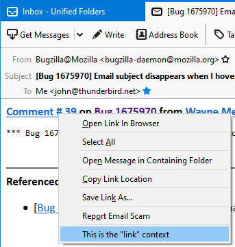
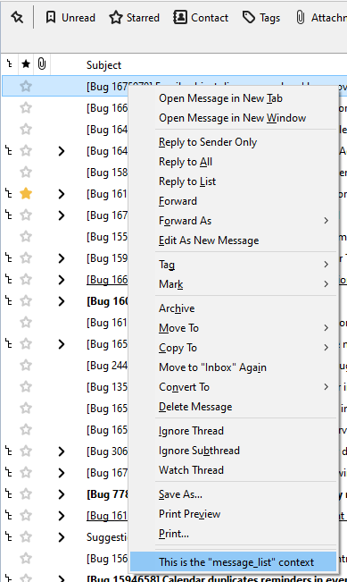
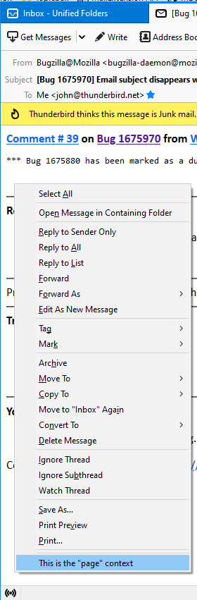
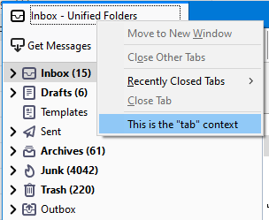

# Supported UI Elements

## Browser Action

A browser action adds a button to Thunderbird's main toolbar:

.png>)

It is controlled by the `browser_action` manifest key in the extension's `manifest.json` file:

```javascript
"browser_action": {
    "default_title": "Restart",
    "default_icon" : "restart.png",
    "default_popup": "browser_popup.html"
},
```

If a `default_popup` is defined, a popup will be opened and the defined html page will be loaded, when the button is clicked. Additionally, you can use the [browserAction](https://webextension-api.thunderbird.net/release-mv2/browserAction.html) API in your background script to interact with the button to modify _badge text_, _icon_, _title_ or its _enabled state_.

If the action button is defined as a [menu typed action button](https://github.com/thunderbird/webext-examples/tree/master/manifest_v2/menuActionButton), it will open a drop-down menu when clicked.&#x20;

**Note:** The `browserAction` API has been renamed to `action` in [Manifest V3](https://webextension-api.thunderbird.net/release-mv3/action.html).

## Compose Action

A compose action adds a button to the toolbar of the composer window:



It is controlled by `compose_action` manifest key in the extension's `manifest.json` file:

```javascript
"compose_action": {
    "default_title": "Expand lists",
    "default_icon" : "lists.png",
    "default_popup": "compose_popup.html"
},
```

If a `default_popup` is defined, a popup will be opened and the defined html page will be loaded, when the button is clicked. Additionally, you can use the [composeAction](https://webextension-api.thunderbird.net/release-mv2/composeAction.html) API in your background script to interact with the button to modify _badge text_, _icon_, _title_ or its _enabled state_.

If the action button is defined as a [menu typed action button](https://github.com/thunderbird/webext-examples/tree/master/manifest_v2/menuActionButton), it will open a drop-down menu when clicked.

## Message Display Action

A message display action adds a button to the toolbar of the message view window:


It is controlled by the `message_display_action` manifest key in the extension's `manifest.json` file:

```javascript
"message_display_action": {
    "default_title": "Copy Patch",
    "default_icon" : "patch.png",
    "default_popup": "message_popup.html"
    },
```

If a `default_popup` is defined, a popup will be opened and the defined html page will be loaded, when the button is clicked. Additionally, you can use the [messageDisplayAction](https://webextension-api.thunderbird.net/release-mv2/messageDisplayAction.html) API in your background script to interact with the button to modify _badge text_, _icon_, _title_ or its _enabled state_.

If the action button is defined as a [menu typed action button](https://github.com/thunderbird/webext-examples/tree/master/manifest_v2/menuActionButton), it will open a drop-down menu when clicked.

## CloudFile Provider Configuration

Thunderbird supports cloud providers to upload large attachments to a server, instead of attaching them directly to the email. Extensions can register such cloud providers using the [CloudFile](https://webextension-api.thunderbird.net/release-mv2/cloudFile.html) API. These providers can be managed in Thunderbird's Composition options:



## Menu Items

The [menus](https://webextension-api.thunderbird.net/release-mv2/menus.html) API allows modifying Thunderbird's menus by adding or overriding menu items. The menu items can be added to different menus based on the provided `context` type. Examples can be found in our [example repository](https://github.com/thunderbird/webext-examples/tree/master/manifest_v2/menu).

Thunderbird menus are accessible through the following context types:

<table><thead><tr><th width="372.3333333333333">Context</th><th width="369">Description</th></tr></thead><tbody><tr><td><code>all</code></td><td>Add menu entries to all supported contexts, excluding <code>tab</code> and <code>tools_menu</code>.</td></tr><tr><td><code>all_message_attachments</code></td><td>Add entries to the context menu of the summary area of message attachments.<br><br><br><br>If the message has only one attachment, then the <code>message_attachments</code> context is used instead.</td></tr><tr><td><code>action</code>,<br><code>browser_action</code>, <code>compose_action</code> , <code>message_display_action</code><br><br>N<strong>ote</strong>: <code>browser_action</code> is available in Manifest V2 and <code>action</code> is available in<br>Manifest V3.</td><td>Add entries to the context menu of action buttons.<br><br></td></tr><tr><td><code>action_menu</code>,<br><code>browser_action_menu</code>, <code>compose_action_menu</code>, <code>message_display_action_menu</code>,<br><br><strong>Note</strong>: <code>browser_action_menu</code> is available in Manifest V2 and <code>action_menu</code> is available in Manifest V3.</td><td><p>Add entries to the drop-down menu of <a href="https://github.com/thunderbird/webext-examples/tree/master/manifest_v2/menuActionButton">menu typed action buttons</a>.</p><p></p><p> </p></td></tr><tr><td><code>compose_attachments</code></td><td>Add entries to the context menu of attachments in the compose window.<br><br></td></tr><tr><td><code>editable</code>,<br><code>password</code></td><td><p>Add entries to the context menu of text/password input fields in WebExtension windows, web tabs or message display tabs.<br></p><p>Limited to content areas.<br><br></p></td></tr><tr><td><code>folder_pane</code></td><td>Add entries to the context menu of the folder pane of mail tabs. <br><br></td></tr><tr><td><code>image</code>,<br><code>audio</code>,<br><code>video</code></td><td>Add entries to the context menu of embedded images, audio or video players in WebExtension windows, web tabs or message display tabs.<br><br>Limited to content areas.<br><br></td></tr><tr><td><code>link</code></td><td><p>Add entries to the context menu of links in WebExtension windows, in web tabs or in message display tabs.</p><p><br>Limited to content areas.<br><br></p></td></tr><tr><td><code>message_attachments</code></td><td>Add entries to the context menu of attachments of messages.<br><br></td></tr><tr><td><code>message_list</code></td><td>Add entries to the context menu of the message list area of a mail tab.<br><br></td></tr><tr><td><code>page</code>,<br><code>frame</code></td><td><p>Add entries to the context menu of WebExtension windows, web tabs or message display tabs, if none of the other content contexts apply (link, selection, image, audio, video, editable, password).</p><p><br>If the page is loaded inside a frame, the <code>frame</code> context applies, otherwise the <code>page</code> context. <br><br>Limited to content areas. <br><br></p></td></tr><tr><td><code>selection</code></td><td><p>Add entries to the context menu in WebExtension windows, web tabs or message display tabs, if any text has been selected.<br></p><p>Limited to content areas.<br><br></p></td></tr><tr><td><code>tab</code></td><td><p>Add entries to the context menu of tab ribbons.<br><br></p><p></p><p>The <code>tab</code> context can also be used to override the context menu of content pages (action popups or content tabs).</p><p></p><p></p><p></p><p>See the <a href="https://github.com/thunderbird/webext-examples/tree/master/manifest_v2/menu">menu example</a> for more details.</p></td></tr><tr><td><code>tools_menu</code></td><td>Add entries to Thunderbird's tools menu.<br><br></td></tr></tbody></table>

