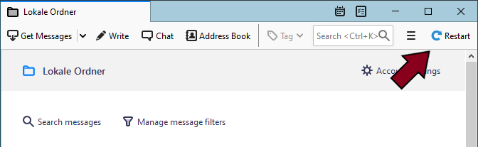
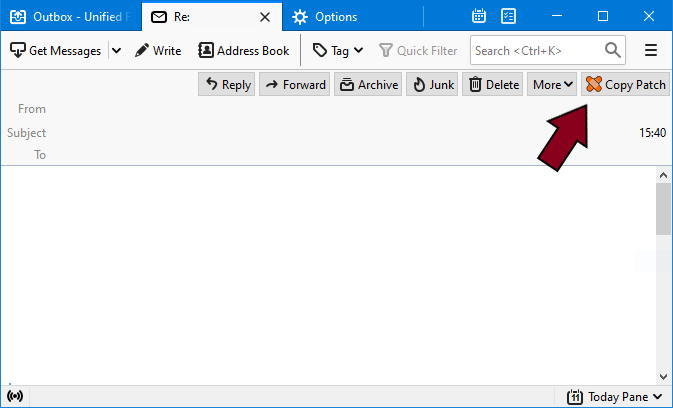
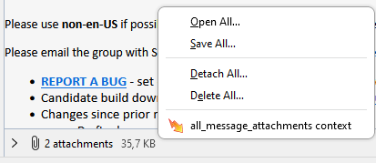
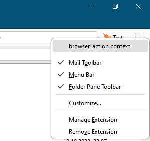
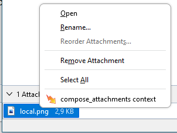
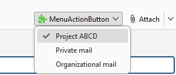
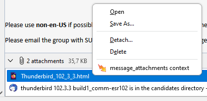
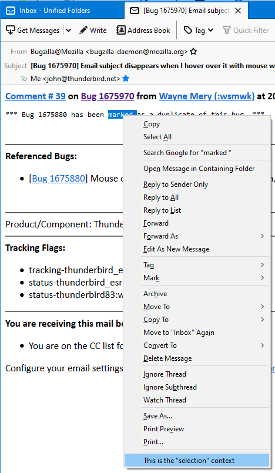

# Supported UI Elements

## Browser Action

A browser action adds a button to Thunderbird's main toolbar:



It is controlled by the `browser_action` manifest key in the extension's `manifest.json` file:

```javascript
"browser_action": {
    "default_title": "Restart",
    "default_icon" : "restart.png",
    "default_popup": "browser_popup.html"
},
```

If a `default_popup` is defined, a popup will be opened and the defined html page will be loaded, when the button is clicked. Additionally, you can use the [`browserAction`](https://webextension-api.thunderbird.net/en/latest/browserAction.html) API in your background script to interact with the button to modify _badge text_, _icon_, _title_ or its _enabled state_.

**Note:** The `browserAction` API has been renamed to `action` in[ manifest v3](https://webextension-api.thunderbird.net/en/latest-mv3/action.html).

## Compose Action

A compose action adds a button to the toolbar of the composer window:


It is controlled by `compose_action` manifest key in the extension's `manifest.json` file:

```javascript
"compose_action": {
    "default_title": "Expand lists",
    "default_icon" : "lists.png",
    "default_popup": "compose_popup.html"
},
```

If a `default_popup` is defined, a popup will be opened and the defined html page will be loaded, when the button is clicked. Additionally, you can use the [`composeAction`](https://webextension-api.thunderbird.net/en/latest/composeAction.html) API in your background script to interact with the button to modify _badge text_, _icon_, _title_ or its _enabled state_.

## Message Display Action

A message display action adds a button to the toolbar of the message view window:



It is controlled by the `message_display_action` manifest key in the extension's `manifest.json` file:

```javascript
"message_display_action": {
    "default_title": "Copy Patch",
    "default_icon" : "patch.png",
    "default_popup": "message_popup.html"
    },
```

If a `default_popup` is defined, a popup will be opened and the defined html page will be loaded, when the button is clicked. Additionally, you can use the [`messageDisplayAction`](https://webextension-api.thunderbird.net/en/latest/messageDisplayAction.html) API in your background script to interact with the button to modify _badge text_, _icon_, _title_ or its _enabled state_.

## CloudFile Provider Configuration

Thunderbird supports cloud providers to upload large attachments to a server, instead of attaching them directly to the email. Extensions can register such cloud providers using the [`CloudFile`](https://webextension-api.thunderbird.net/en/latest/cloudFile.html) API. These providers can be managed in Thunderbird's Composition options:


## Menu Items

The [`menus`](https://webextension-api.thunderbird.net/en/latest/menus.html) API allows modifying Thunderbird's menus by adding or overriding menu items. The menu items can be added to different menus based on the provided `context` type. The following values are currently supported:

| `all`                                                                   | All allowed contexts, excluding `tab`.                                                                                                                                                                                                                                                                                                                                                                                                   |
| ----------------------------------------------------------------------- | ---------------------------------------------------------------------------------------------------------------------------------------------------------------------------------------------------------------------------------------------------------------------------------------------------------------------------------------------------------------------------------------------------------------------------------------- |
| `all_message_attachments`                                               | <p>Context menu on the summary of the message attachments.<br><br><br><br>If the message has only one attachment, then the <code>message_attachments</code> context is used instead.</p>                                                                                                                                                                             |
| `browser_action`, `compose_action` , `message_display_action`           | <p>Context menu of action buttons.<br><br></p>                                                                                                                                                                                                                                                                                                                        |
| `compose_attachments`                                                   | <p>Context menu of attachments in the compose window.<br><br></p>                                                                                                                                                                                                                                                                                                |
| <p><code>editable</code>,<br><code>password</code></p>                  | <p>Context menu of text/password input fields in WebExtension windows, web tabs or message display tabs.<br></p><p>Limited to content areas.<br><br></p>                                                                                                                                                                                                       |
| `folder_pane`                                                           | <p>Context menu of the folder pane of mail tabs. Not limited to a folder entry.<br><br></p>                                                                                                                                                                                                                                                                 |
| <p><code>image</code>,<br><code>audio</code>,<br><code>video</code></p> | <p>Context menu of embedded images, audio or video players in WebExtension windows, web tabs or message display tabs.<br><br>Limited to content areas.<br><br></p>                                                                                                                                                                                                |
| `link`                                                                  | <p>Context menu of links in WebExtension windows, in web tabs or in message display tabs.</p><p><br>Limited to content areas.<br><br></p>                                                                                                                                                                                                                          |
| `message_attachments`                                                   | <p>Context menu of a single message in the attachments area.<br><br></p>                                                                                                                                                                                                                                                                                         |
| `message_list`                                                          | <p>Context menu of the message list area of a mail tab. Not limited to a message list entry.<br><br></p>                                                                                                                                                                                                                                                   |
| <p><code>page</code>,<br><code>frame</code></p>                         | <p>Context menu of WebExtension windows, web tabs or message display tabs, if none of the other content contexts apply (link, selection, image, audio, video, editable, password).</p><p><br>If the page is loaded inside a frame, the <code>frame</code> context applies, otherwise the <code>page</code> context. <br><br>Limited to content areas. <br><br></p> |
| `selection`                                                             | <p>Context menu in WebExtension windows, web tabs or message display tabs, if any text has been selected.<br></p><p>Limited to content areas.<br><br></p>                                                                                                                                                                                                     |
| `tab`                                                                   | <p>Context menu of tab ribbons.<br><br></p>                                                                                                                                                                                                                                                                                                                                              |

\`\`
