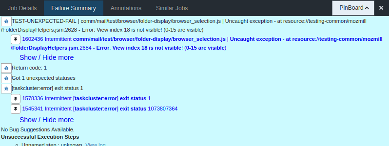

# Care and Feeding of TreeHerder

## Existing failures

Our code is not perfect. You might have noticed. :-\)

Some things fail occasionally \(we call these intermittent failures\) or most of the time \(permanent failures\). If a test fails every now and then, it's not generally a problem – usually it's a sign that a test hasn't accounted for something, like some asynchronous code happening in a different order than expected.

### Marking intermittent failures

We file bugs about intermittent failures in the hope that one day we'll have time to investigate and fix them. Bugs with the `intermittent-failure` keyword are displayed in the Failure Summary section if they are a close match with the error message in the log:

If you're sure a bug description is the right one, click the pin icon next to it. This adds the current task to the pinboard and the bug number to the classification. If you're logged in you can click save to associate the bug with the task. The task gains a little star icon to mark that somebody's looked at it and understood it.

If a _new_ intermittent failure appears, you can click the blue bug icon next to the error message to file a new bug. This does a lot of the legwork for you, all you have to do is choose the right Bugzilla component so that it gets some attention.


Usually new intermittent failures get ignored for a while and they go away, or are so infrequent it's not worth the hassle. Don't feel the need to file a bug about every one you see.

Some things aren't usually starred, like out-of-memory failures on debug builds or failures from mozilla-central tests \(ours all start with `comm/`\). There's little benefit to doing so.


The pinboard can be used for other things. Collect tasks there with the pin icon or ctrl+clicking on them, and you can mark tasks as expected failures or to say they've been fixed by something that has landed since.

## New failures

If the build fails, we've got a serious problem that should be dealt with before anything else lands. Landing more patches on top of a broken tree just makes things worse and harder to debug. Unfortunately, Firefox developers don't stop if we have a problem.

If a test starts failing on multiple platforms, something is broken and should be dealt with. Some failures can hide other failures, and it's not nice to fix one only to find another has appeared in the meantime.


History lesson: a long time ago, when bug numbers had five digits, TreeHerder's predecessor was Tinderbox, a huge grid showing the status of every build and test machine. Statuses were displayed in various colours: green, yellow, red, and black with flames \(an animated GIF!\). If you see the phrase "\[xyz\] is burning", that's where it comes from.


### Debugging

This is really not an easy thing to describe. Much of it comes down to intuition and experience.

#### What happened?

Check the Failure Summary of TreeHerder for the most basic details. Check the task log for more information. Mochitests usually produce a screenshot of the first failure in a task. This is linked from the Job Details section named mozilla-test-fail-screenshot\_XxYyZz.png.

#### What changed on mozilla-central?

The most likely cause of an unexpected failure is a change to mozilla-central. Sometimes we are warned in advance of things we need to do, sometimes not. To figure out what has changed on mozilla-central, get the revision from the last build before the problem and the first build with the problem, by clicking on the build task or the decision task \(D or Nd\):

You can then view the mozilla-central pushlog by copying the revisions into the URL:  
https://hg.mozilla.org/mozilla-central/pushloghtml?fromchange=**\[good revision\]**&tochange=**\[bad revision\]**

From there it's a matter of finding the most likely candidates and figuring out if they are the cause of the problem. In many cases there's a change that needs to be copied into comm-central.

### Remedies

#### Fixing a test

Great, you've figured out what's wrong and how to fix it. Get that fix reviewed and landed! If the failure is sufficiently serious, you can land the fix and then get it reviewed later. If you do this, use `rs=bustage-fix` in your commit message to say why you landed it without review.

#### Disabling a test

To disable a test, add the appropriate `skip-if` notation to the test manifest. `skip-if = true` disables the test on all platforms. Other options are available, check the tree for examples. **If you disable a test there must be a bug filed about it.** Use the magic words `[thunderbird-disabled-test]` in the bug whiteboard and make sure appropriate developers are notified so the test can be fixed and re-enabled.

#### Backout

If it looks like a Thunderbird developer is responsible for causing a problem, contact them or their reviewer. If neither can be found and there's a serious failure, consider backing out their changes. Check whether you're right first – finding out your work has been backed out overnight is not the nicest way to start a day.

