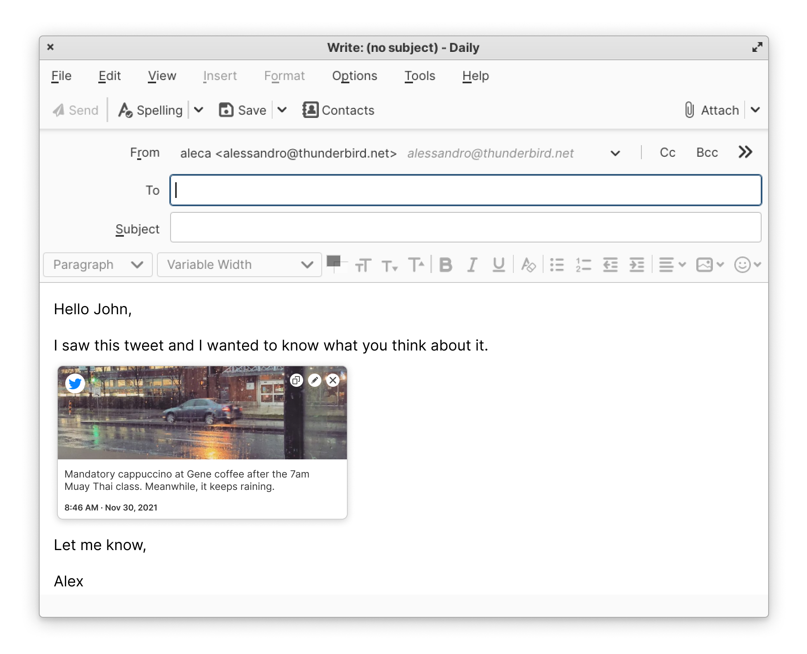

# Roadmap

Below are the large projects planned for the 102 (2022) release of Thunderbird.

## Spaces Toolbar

The Spaces toolbar allows users an easier, more convenient way to move between the different parts of the application (such as mail, calendar, tasks and full-tab add-ons).


Link to tracking bug for Spaces Toolbar


## New Address Book

A new address book (both backend and UX/UI) that makes it easier to navigate and provides a richer experience for interacting with contacts.


Meta bug for the new address book


## Link Preview Card

When a link is added in the composer, you will have the option to convert it into a rich link preview with content displayed from the website.


Link Preview Card tracking bug.


## Account Setup Hub

When setting up an email, autodiscovery of calendars and address books works really well! But managing accounts and setting up after the first time has lagged. We are updating that experience in 102 with a centralized place to set up accounts, with a consistent experience regardless of when you bring a new account into Thunderbird.


Account setup hub tracking bug.


## Import/Export

We have many users that have been using the Import/Export Tools add-on, we decided to bring that functionality into Thunderbird (and it has been requested for 18 years, check out the bug).  This will allow users more data portability and the ability to more easily bring their data into Thunderbird (as well as take it out).


Tracking bug for Import/Export.


## Message Header Redesign

Improved message header to better highlight important information and make it responsive, so it will look better at any screen size/window size.


Message header tracking bug.


## Maildir

Maildir is a message storage format that should improve data safety, allow for incremental (delta) backups of messages and allow for antivirus to interact better with messages. Maildir will be vastly improved for 102, but may not be pref'd on by default.



## Protocol Rewrites

### POP3 in Javascript


Meta bug for rewriting POP3 in Javascript


### NNTP in Javascript



