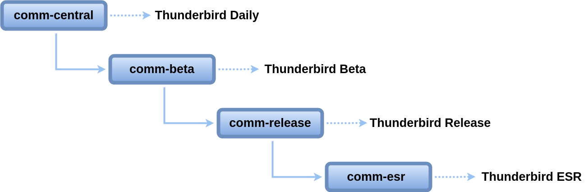

## Thunderbird Release Cadence

### Thunderbird Release Train Model

Thunderbird follows a release train model to ensure timely and predictable releases. This approach allows for regular feature rollouts, stability improvements, and bug fixes.

### General Release Cadence
The general release cadence consists of 4-week cycles, with each branch corresponding to a specific release channel. Each branch, starting from comm-central, is based on the previous branch.

---

### **Release Channels**

#### **Thunderbird Daily**
- **Release Timeline**: A new major version of Thunderbird Daily begins every 4 weeks.
- **Releases**: Thunderbird Daily is automatically released on a daily basis from comm-central.

#### **Thunderbird Beta**
- **Release Timeline**:
  - A new major version of Thunderbird Beta begins every 4 weeks.
  - 4 weeks after Daily starts for a new version, comm-central is merged into comm-beta.
- **Releases**: Thunderbird Beta for this version is released weekly for the next 3 weeks.
  - **Beta 1**: Includes the merged code.
  - **Beta 2 and above**: Include any new uplifts.

#### **Thunderbird Release**
- **Release Timeline**:
  - A new major version of Thunderbird Release begins every 4 weeks.
  - 3 weeks after Beta starts for a new version, comm-beta is merged into comm-release.
  - 1 week after this merge, the monthly Thunderbird Release is published.
- **Releases**: Thunderbird Release is released every 4 weeks, with point releases as needed every 2 weeks.

#### **Thunderbird ESR (Extended Support Release)**
- **Release Timeline**: The code from comm-release is merged into comm-esr\<version\> once a year.
- **Releases**: Thunderbird ESR is released every year, typically in July, with point releases as needed every 2 weeks.

---

### **Stabilization Milestones**

#### **Daily Soft Code Freeze**
- A 4-day soft code freeze occurs for comm-central prior to merging into comm-beta.
- During this time:
  - Risky code should not land in comm-central.
  - Features controlled by a feature flag that were disabled in Daily should not be enabled.

#### **Pre-Merge Reviews**
- Prior to both merges, reviews are conducted for all changes included in the merge.
- Code may be backed out if:
  - It is deemed too risky.
  - It introduces new crashes or high-severity bugs.
  - It reduces the overall quality of Thunderbird.
  - A follow-up fix cannot be provided in a reasonable timeframe.

---

### **Sample Release Timeline for Thunderbird 136**

| Milestone                                | Date         |
|------------------------------------------|--------------|
| Thunderbird 136.0a1 starts               | Jan 6        |
| Thunderbird 136.0a1 pre-merge review     | Jan 30       |
| Thunderbird 136.0a1 soft code freeze     | Jan 30–Feb 3 |
| Thunderbird merge 136.0a1 central → beta | Feb 3        |
| Thunderbird 136.0b1                      | Feb 5        |
| Thunderbird 136.0b2                      | Feb 12       |
| Thunderbird 136.0b3                      | Feb 19       |
| Thunderbird 136.0b4                      | Feb 24       |
| Thunderbird 136.0b4 pre-merge review     | Feb 24       |
| Thunderbird merge 136.0b4 beta → release | Feb 25       |
| Thunderbird 136.0                        | Mar 4        |
| Thunderbird 136.0.1                      | Mar 18       |

---

### **Thunderbird Milestones Calendar**
You can view Thunderbird release milestones on the [Thunderbird Release Calendar](https://calendar.google.com/calendar/u/0/embed?src=c_f7b7f2cea6f65593ef05afaf2abfcfb48f87e25794468cd4a19d16495d17b6d1@group.calendar.google.com).

