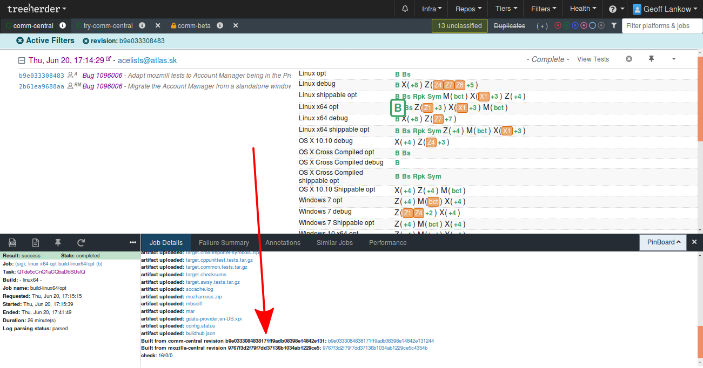

# Artifact Builds


This pages assumes you already have some familiarity with the concepts of building Thunderbird. It is probably not suitable for absolute beginners.


Building everything can take a long time, and in many cases is completely unnecessary. If the changes you are making are limited to the UI, or tests, or even some back-end things, then compiling and linking the unchanged C++ and Rust code produces the same results every time. So let's get someone else to do it for us.

This the idea behind _artifact builds._ Instead of spending our time doing the building, we instead download pre-built copies of those parts \(the "binary components"\) from the build infrastructure. Then we build everything else \(what we're interested in\) around them. This can reduce time spent from hours to a few minutes.

There is a number of important caveats, so make sure you understand them before going on.

## When can I use an artifact build?

In the simplest terms, if the code you are changing appears as plain-text in the final built output, you can use an artifact build. This includes:

* Javascript
* CSS
* XUL
* HTML
* Pre-processed versions of any of the above
* Any support files such as images

## When _can't_ I use an artifact build?

You can't use an artifact build if the code you are changing includes:

* C or C++
* Rust
* IDL interfaces if the binary components use the interface
* Statically-linked component `.conf` files \(even if the component is written in JS\)
* Some types of build configuration changes
* … and probably others

## Modifying your build setup

How you set up to build depends on your scenario. Many people will still need to do a complete build sometimes. In this case, make a copy of your existing `mozconfig` file and add these lines:

```text
mk_add_options MOZ_OBJDIR=obj-artifact
ac_add_options --enable-artifact-builds
```

Line 1 ensures your artifact build goes in a separate object directory. Don't use the same object directory for both types of builds. Line 2 enables artifact building.

From here, remember to make sure you're using the right `mozconfig` \(`export MOZCONFIG=/path/to/artifact.mozconfig`\).

If you don't need to do a complete build, you can just add line 2 to your existing `mozconfig`.

## Building the right thing

As stated earlier, the build process downloads the binary components from the build infrastructure. Here's where things can get a little bit messy.

First, things can only be downloaded if they exist. So you need to make sure what you want is available. Mach will download from the _latest successful non-nightly build_ that matches your current `comm-central` tree. This might not be the one you expect.

Example: if your platform is 64-bit Linux and your tree was up-to-date at this point, which build will you get?



This screenshot is from [https://treeherder.mozilla.org/\#/jobs?repo=comm-central](https://treeherder.mozilla.org/#/jobs?repo=comm-central). Check what's going on there before updating your build. Note that "Linux x64 opt" is not the same as "Linux x64 shippable opt" for our purposes.


In this example you have a choice:

* wait for the running build to complete \(that is, the `B` to turn green, you don't need to wait for the tests\) before building locally
* build now, from the last successful build and hope the changes that have landed since don't affect you
* "update" your trees back to their state when the last successful build happened

## Updating to the right revision

To find the revisions used for a successful build, click on the `B`, and go down to the bottom of the Job Details tab:



Update both comm-central _and_ mozilla-central trees using `hg update -r abcdef1234` before building. In general, when a new build begins on the build infrastructure, it uses the latest mozilla-central as well as the latest comm-central, but that may no longer be the case by the time you build.

## Other tips

* The build process logs a lot about what it's doing. This can help you understand exactly what's going on so read it the first few times you build.
* You can in many cases do an even quicker rebuild \(for example to remake pre-processed files\) by running `./mach build faster` \(or `../mach build -C . faster` if your current directory is comm-central\). This skips a bunch of steps at the beginning and end of the build process that you might not need. When in doubt, don't build faster.
* Calendar is built differently in an artifact build but this shouldn't affect most people.

## Artifact builds on the Try server

Using an artifact build on the Try server can save you _a lot_ of time, and it also reduces our infrastructure costs. The same conditions about when you can and can't do an artifact build apply, plus only 64-bit builds are working.

To do an artifact Try run, add `--artifact` to your try syntax. For example:

```text
try: -b o -p linux64,macosx64-shippable,win64 -u all --artifact
```

\(Debug builds also work but you'd specify just `macosx64` in that case.\)

You can \(and should in a lot of cases\) specify a mozilla-central revision to build from, by editing the file `.gecko_rev.yml`, replacing `default` with the revision you need. If you don't, the Try server will use the latest mozilla-central revision, which may or may not be the same one used for the latest comm-central build.

