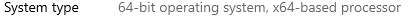

# Windows Build Prerequisites

## The Basics

### 64-bit Windows

You will need to be running a 64-bit version of Windows in order to build Thunderbird. To check this in Windows 10, open the start menu and click on the gear icon on the left-hand side of the menu. This will open up the "settings" window. Click on the "System" option and then scroll down to "About". Click on the "About" option and on the new screen next to "System Type" you should see: "**64-bit operating system"**



### **Visual Studio**

In order to get the necessary libraries in order to build Thunderbird, you will need to install Visual Studio - an IDE from Microsoft. [Download the free community edition here](https://visualstudio.microsoft.com/downloads/).

During installation make sure the following workloads are checked:

* "Desktop development with C++"
* "Game development with C++"

### MozillaBuild Package

Finally, download the [MozillaBuild Package](https://ftp.mozilla.org/pub/mozilla.org/mozilla/libraries/win32/MozillaBuildSetup-Latest.exe) from Mozilla. Accept the default settings, in particular the default installation directory: `c:\mozilla-build\`. On some versions of Windows an error dialog will give you the option to ‘reinstall with the correct settings’ - you should agree and proceed.


Once this is done, creating a shortcut to `c:\mozilla-build\start-shell.bat` on your desktop will make your life easier.



**NOTE: You will need to run the start-shell.bat to open up the shell and perform the commands listed in other parts of this guide.**


### Getting the Code

Once you have run start-shell.bat, you will need to grab the source code if you haven't already.

Get the latest Mozilla source code from Mozilla's `mozilla-central` Mercurial code repository, and check it out into a local directory `source` \(or however you want to call it\). Then, get the latest Thunderbird source code from Mozilla's `comm-central` Mercurial code repository. It now needs to be placed **inside** the Mozilla source code, in a directory named `comm/` \(this is inverse from Thunderbird 59 and earlier\):

```bash
hg clone https://hg.mozilla.org/mozilla-central source/
cd source/
hg clone https://hg.mozilla.org/comm-central comm/
```

### Mach Bootstrap

In the `source` directory run the following command to get additional dependencies needed to install Thunderbird:

```bash
./mach bootstrap
```

You will be presented with the following options:

```text
Please choose the version of Firefox you want to build:
  1. Firefox for Desktop Artifact Mode
  2. Firefox for Desktop
  3. GeckoView/Firefox for Android Artifact Mode
  4. GeckoView/Firefox for Android
```

Please choose option 2 to proceed with a successful build.

This action will install all the remaining libraries and dependencies necessary to build Thunderbird locally.


**Make sure to restart after installing all the requirements, or Thunderbird might encounter a build error.**


## You're all set

Go back to the [Prerequisites for the build](./#build-configuration) page and continue following the guide:


