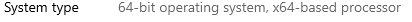

# Setting Up A Build Environment

Before you can build Thunderbird, please follow your platform's build prerequisites steps.


Note that the Thunderbird build can use 30-40GB of disk space to complete depending on your operating system.


## Windows

#### 64-bit Windows

You will need to be running a 64-bit version of Windows in order to build Thunderbird. To check this in Windows 10, open the start menu and click on the gear icon on the left-hand side of the menu. This will open up the "settings" window. Click on the "System" option and then scroll down to "About". Click on the "About" option and on the new screen next to "System Type" you should see: "**64-bit operating system"**



#### **Visual Studio**

In order to get the necessary libraries in order to build Thunderbird, you will need to install Visual Studio - an IDE from Microsoft. [Download the free community edition here](https://visualstudio.microsoft.com/downloads/).

During installation make sure the following workloads are checked:

* "Desktop development with C++"
* "Game development with C++"

#### MozillaBuild Package

Finally, download the [MozillaBuild Package](https://ftp.mozilla.org/pub/mozilla.org/mozilla/libraries/win32/MozillaBuildSetup-Latest.exe) from Mozilla. Accept the default settings, in particular the default installation directory: `c:\mozilla-build\`. On some versions of Windows an error dialog will give you the option to ‘reinstall with the correct settings’ - you should agree and proceed.


Once this is done, creating a shortcut to `c:\mozilla-build\start-shell.bat` on your desktop will make your life easier.



**NOTE: You will need to run the start-shell.bat to open up the shell and perform the commands listed in other parts of this guide.**


Once you have run start-shell.bat, you are ready to proceed to the next section to grab the source code.

## Linux

#### 64-bit version

You will need to be running a 64-bit version of Linux in order to build Thunderbird. You can check which version you're running by typing this command in your terminal:

```
uname -m
```

if this command returns `x86_64` you can proceed.

### Build Environment

#### Python

You’ll need `Python 3.8` or later installed.

You can check with `python3 --version` to see if you have it already. If not, you can install it with your distribution’s package manager. Make sure your system is up to date!

You will also need `python3-distutils` and `python3-pip` installed from your distribution's package manager.

#### Git

Both Firefox and Thunderbird sources are stored in Git repositories. This means you will need to install Git if it is not already available. Here are some quick commands to install on common distributions:

**Ubuntu/Debian**

```
sudo apt install git
```

**Fedora**

```
sudo dnf install git
```

Once you have Git installed, you are ready to proceed to the next section to grab the source code.

## MacOS

### Build Environment

#### Python

You will need `python` (version 3.8 or later) and `pipx` (used to install packages from `pypi`). Both of these can be installed from homebrew. If you have not yet setup homebrew, please see [the homebrew installation instructions](https://brew.sh/).

```
brew install python pipx
```


Note that once homebrew is installed, the macOS SDK headers are installed already and can be found under `/Library/Developer/CommandLineTools/SDKs`. There should be no additional action required to install these SDK headers.


#### Use pipx to Install mozphab

MozPhab is the tool needed to interface with Mozilla's instance of Phabricator. This step is needed before the bootstrap step. Pipx is the tool that we will use to install MozPhab and then we will make sure the relevant `~/.local/bin` has been added to the PATH envirnoment variable.

```
pipx install MozPhab
pipx ensurepath 
```

#### Git

Both Firefox and Thunderbird sources are stored in Git repositories. This means you will need to install Git if it is not already available. Here is a quick command to install it:

```
brew install git
```

Once you have MozPhab and Git installed, you are ready to proceed to the next section to grab the source code.

## Get the Source Code

There are a couple of different methods to get the code, a scripted approach and a manual approach. Note that the scripted method is only available to Linux and MacOS users.


Firefox can build without Thunderbird present in the `comm/` repo and a few options set. The Thunderbird code base features the additions that turn Firefox into Thunderbird.


### Scripted - Linux and MacOS only

We have created and host a script that will grab the two source repos you need, run `./mach bootstrap` for you, and sets up a necessary `mozconfig` file. This script is called [`bootstrap.py`](https://hg.mozilla.org/comm-central/raw-file/tip/python/rocboot/bin/bootstrap.py). Download this file to the directory where you would like your source code folder to live, either by clicking the link and moving the file to the appropriate location or using `wget`. Then we will make it executable and run it.

```
mkdir tb-build && cd tb-build
wget https://raw.githubusercontent.com/thunderbird/thunderbird-desktop/main/python/rocboot/bin/bootstrap.py
chmod +x bootstrap.py
./bootstrap.py
```

This will create a `source/` directory with both a `mozconfig` and a `comm/` folder inside.

The `source/` repository contains the Firefox source and defaults to the `main` branch.

The `source/comm` repository also defaults to the `main` branch.

The `mozconfig` file is setup to build Thunderbird and you can verify this with `cat mozconfig`; the `--enable-project` parameter should be `comm/mail`:

```
ac_add_options --enable-project=comm/mail
```

### Manually - Windows, Linux, and MacOS

If you would rather manually gather the source code, perform the bootstrap, and create your `mozconfig` file, then follow these steps.

#### Checkout the Source Code

Get the latest Firefox source code, and check it out into a local directory `source` (or however you want to call it). Then, get the latest Thunderbird source code. It needs to be placed **inside** the Mozilla source code, in a directory named `comm/`:

```
git clone https://github.com/mozilla-firefox/firefox source/
cd source/
git clone https://github.com/thunderbird/thunderbird-desktop comm/
```

#### Create `mozconfig` file

This step will need to be performed if you manually checked out the code and performed the bootstrap, and it will covered in the next section you follow, [Building Thunderbird](building-thunderbird/#build-configuration).

#### Mach Bootstrap

In the `source` directory run the following command to get additional dependencies needed to install Thunderbird:

```
./mach bootstrap
```

You will be presented with the following options:

```
Please choose the version of Firefox you want to build:
  1. Firefox for Desktop Artifact Mode
  2. Firefox for Desktop
  3. GeckoView/Firefox for Android Artifact Mode
  4. GeckoView/Firefox for Android
```

Please choose option 2 to proceed with a successful build.

This action should install all the remaining libraries and dependencies necessary to build Thunderbird locally.


**Make sure to restart after installing all the requirements, or Thunderbird might encounter a build error.**


### Missing libraries

It could happen that some libraries will not be installed by the `bootstrap` command, specifically `Rust` and `Go`. Check if these packages are available in your system by running these commands in your terminal:

* `which rustc`
* `which cargo`

If one or both commands return an empty output, you need to install them manually. You can find manual install steps for Rust and the C bindings for Linux and MacOS below. (For Windows uers, the `start-shell.bat` script should make sure all of your dependencies are installed correctly.)

#### Linux

* Install Rust: `curl https://sh.rustup.rs -sSf | sh`
* Install C bindings: `cargo install cbindgen`

#### MacOS

We recommend using [HomeBrew](https://brew.sh/) to download and install these packages in your system. After that, follow these steps:

* Install Rust: `brew install rust`
* Install C bindings: `cargo install cbindgen`


If you get a `command not found` error while running `cargo`, but the command `which cargo` returns the location of the that package, it means you need to update your `PATH` inside your `.bashrc` file to include the `cargo` location:

```
export PATH=$HOME/.cargo/bin:$PATH
```



If you still are unable to find rustc and cargo via the ˋwhichˋ command after installing them, you may need to restart your session (log out and back into your user account, or restart your computer) to be able to see them.


## What's Next

If you have already gone through the relevant build prerequisite steps and gotten the source code, then you can learn more about the repository structure OR dive right into building the latest Thunderbird.


[git-repository-information.md](git-repository-information.md)



[building-thunderbird](building-thunderbird/)

